# Focal 使い方ガイド

Focal は、RAW 写真の管理と現像を 1 つでこなす、軽量な Mac アプリです。写真は元のファイルのまま扱い（現像の内容はカタログに保存します）、元の RAW ファイルを書き換えることはありません。

- 動作環境: macOS 14（Sonoma）以降、Apple シリコンの Mac
- 画面の表示言語: 日本語・英語（macOS の言語設定に従います）

> このガイドは、アプリの版（design.md v3.19）に合わせています。機能の仕様の詳細は `design.md` を参照してください。

## 目次

1. [はじめに](#1-はじめに)
2. [カタログの管理](#2-カタログの管理)
3. [写真を取り込む](#3-写真を取り込む)
4. [写真を整理する](#4-写真を整理する)
5. [現像する](#5-現像する)
6. [書き出す](#6-書き出す)
7. [写真を削除する](#7-写真を削除する)
8. [キーボードショートカット一覧](#8-キーボードショートカット一覧)
9. [設定](#9-設定)
10. [機能一覧・制限事項](#10-機能一覧制限事項)
11. [困ったときは](#11-困ったときは)

---

## 1. はじめに

### 画面の構成

```text
┌────────────────────────────────────────────────────────────┐
│ ツールバー: [ 一覧 | 現像 ]            [絞り込み] [書き出し] [ⓘ] │
├──────────┬──────────────────────────────────┬──────────────┤
│ サイドバー │  メイン                           │ インスペクタ   │
│ ストレージ │  一覧: 写真のグリッド              │ ヒストグラム   │
│ ライブラリ │  現像: 写真 + フィルムストリップ    │ 現像の操作     │
│ アルバム   │                                  │ メタデータ・タグ│
└──────────┴──────────────────────────────────┴──────────────┘
```

- **一覧**と**現像**は、ツールバー中央のスイッチ（⌘1 / ⌘2、または `V` キー）で切り替えます。
- **サイドバー**は、どの写真の集まりを見るかを選びます（ストレージのフォルダ・すべての写真・アルバムなど）。
- **インスペクタ**（右）は ⌥⌘I で開閉できます。ヒストグラム、現像のスライダー、写真の情報（メタデータ）、タグが並びます。
- **絞り込みバー**は、ツールバーの「絞り込み」（⌥⌘F）で上から開閉します。

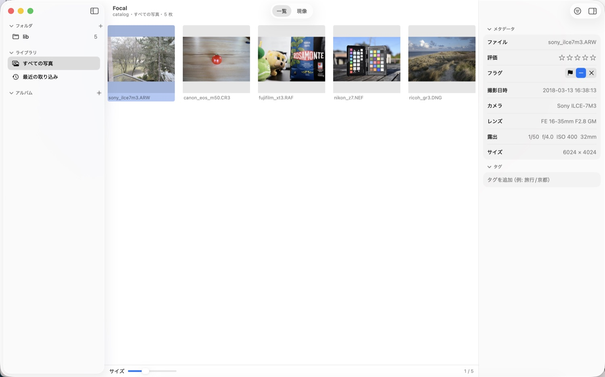

### 初めて起動したとき

「Focal へようこそ」の画面が出ます。

1. **カタログを作成**を押すと、`~/Pictures/Focal/Focal Catalog.focalcatalog` にカタログを作ります（場所を選ぶこともできます）。すでにカタログがあるときは「既存のカタログを開く…」を選びます。
2. 「フォルダを追加…」で、RAW の入ったフォルダを選びます。写真が取り込まれ、グリッドに並びます。

以降、Focal は前回開いたカタログを自動で開きます。

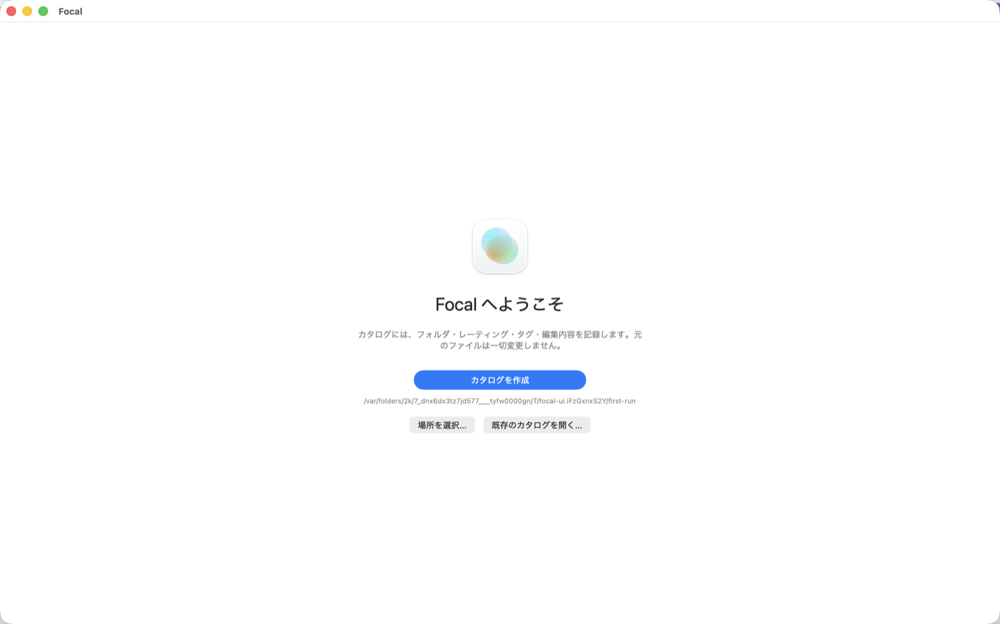

---

## 2. カタログの管理

### カタログとは

**カタログ**は、写真の一覧と、あなたが付けた情報（評価・フラグ・タグ・アルバム）、現像の設定を記録するデータベースです。

- 実体は `〜.focalcatalog` という 1 つのファイル（パッケージ）で、Finder ではダブルクリックで開けます。
- **写真そのものはカタログに入っていません。** 写真は元の場所にあるまま「参照」します（コピーも移動もしません）。そのため、カタログを消しても写真は消えません。逆に、写真を Finder で消したり動かしたりすると、カタログとずれます（後述）。
- 現像の設定は元の RAW には書き込まれず、カタログにだけ保存されます。別の Mac で同じ現像を見るには、カタログも一緒に持っていってください。

### カタログを新規作成する・開く・切り替える

ファイルメニューから操作します。

| 操作 | 方法 |
|---|---|
| 新しいカタログを作る | ファイル ▸ **新規カタログ…** |
| 別のカタログを開く | ファイル ▸ **カタログを開く…**（⌥⌘O）、または Finder で `〜.focalcatalog` をダブルクリック |

切り替えるときは、開いている写真の編集を保存してから新しいカタログを開きます。ウィンドウのサブタイトルに、いま開いているカタログの名前が出ます。

> カタログの保存場所は、設定（⌘,）の「カタログ」で確認できます。

### アップデート時の自動バックアップ

Focal の新しい版でカタログの形式が変わるときは、**変更の前に自動でバックアップ**を作ります（カタログのパッケージの中の `catalog.sqlite.v〈旧版〉-〈日時〉.bak`）。新しい版でうまく動かないときは、このファイルで元に戻せます。なお、**古い Focal は、新しい形式のカタログを開けません**。

### フォルダを追加する（ライブラリのルート）

サイドバー「ストレージ」見出しの **＋** ボタン、またはファイル ▸ **フォルダを追加…**（⌘O）で、RAW の入ったフォルダを登録します。

- 登録したフォルダを**ルート**と呼びます。ルートの中のサブフォルダも、すべて取り込まれます（隠しフォルダ・隠しファイルは対象外）。
- `.photoslibrary`（Apple の「写真」のライブラリ）、`.aplibrary`（Aperture）、`.lrdata`（Lightroom のプレビュー）などのフォルダの**中は調べません**。`~/Pictures` を登録しても、「写真」ライブラリには入りません（Focal は「写真」アプリのライブラリを読みません）。
- 登録される RAW は、拡張子が `3FR` `ARW` `CR2` `CR3` `CRW` `DCR` `DNG` `ERF` `FFF` `GPR` `IIQ` `KDC` `MEF` `MOS` `MRW` `NEF` `NRW` `ORF` `PEF` `RAF` `RAW` `RW2` `RWL` `SR2` `SRF` `SRW` `X3F` のファイルです（Canon・Nikon・Sony・Fujifilm・Olympus・Panasonic・Pentax・Ricoh・Leica・Hasselblad・Phase One・Sigma・Samsung など。読み込みは LibRaw）。JPEG などは写真として登録されません。壊れていて読めないファイルは「非対応」として扱います。
- 取り込みの進み具合は、画面上部に出ます。

### サイドバーの「ストレージ」

登録したフォルダは、**ボリューム（ディスク）ごと**に階層で並びます。

```text
▼ Macintosh HD
   ▼ Photos  ★         ← ★ は「読み込み先」（カードの取り込み先）
      ▶ 2026
▼ SSD-EXT                ← 外れているディスクはグレー（オフライン）
   ▶ Archive
```

- フォルダを選ぶと、そのフォルダ（サブフォルダを含む）の写真だけが一覧に出ます。
- ルートを右クリックすると、次の操作ができます。

| メニュー | 内容 |
|---|---|
| 再スキャン | そのルートを調べ直します |
| 読み込み先にする | カード取り込みのコピー先にします（★ が付きます） |
| Finder で表示 | Finder で開きます |
| カタログから外す… | ルートをカタログから外します（下記） |

### 外付けドライブ・NAS の扱い

- ドライブを外す・NAS が切れると、そのボリュームは**グレーのオフライン表示**になります。ヘルプ（カーソルを乗せる）に「接続されていません」と出ます。数秒おきに状態を見直すので、ケーブルが抜けた場合も反映されます。
- オフラインの間は、**写真が「ファイルなし」になることはありません**。つなぎ直せば元どおり使えます。サムネイルはキャッシュから表示されます（現像など、元のファイルが必要な操作はできません）。
- ドライブをつなぎ直したとき、**ドライブレターやマウント位置が変わっていても**、Focal がディスクを見分けて自動で位置を合わせます。
- NAS（SMB・NFS）も、共有の場所で見分けます。

### 変更を反映する（再スキャン）

Focal の外（Finder など）で写真を追加・削除・名前変更・移動したときは、**再スキャン**で反映します。

- Focal を起動したときに、自動で全ルートを再スキャンします（設定でオフにできます）。
- ファイル ▸ **すべてのフォルダを再スキャン**（⇧⌘R）、またはルートの右クリック ▸ 再スキャンで、手動でも実行できます。
- いま見ているフォルダは常に監視していて、変化があれば自動で再スキャンします。

再スキャンのときの扱い:

| ディスク上の変化 | カタログでの扱い |
|---|---|
| 新しい RAW が増えた | 新しい写真として登録 |
| RAW が消えた（ドライブは接続中） | 「ファイルなし」と表示（★・タグ・編集は残る） |
| 消えた RAW が戻った | もとの写真に復帰 |
| 別のフォルダへ移動した | 名前・サイズ・撮影日時が同じものが 1 枚だけなら、**★・タグ・アルバム・編集を引き継いでつなぎ直す** |
| 大文字小文字だけ名前が変わった | 同じ写真として扱う |
| ファイルの中身（更新日時）が変わった | 読み直す |
| フォルダがなくなった | 写真を持たないフォルダは、サイドバーから消えます（写真を持つフォルダは「ファイルなし」の写真のために残ります） |

### ルートをカタログから外す

ルートを右クリック ▸ **カタログから外す…** を選び、確認で承認します。

- そのルートの写真の**★・フラグ・タグ・アルバムへの所属・現像の設定**が、このカタログから消えます。
- **ディスク上のファイルは消えません。** アルバム自体も残ります（中身は空になります）。
- 同じフォルダをもう一度追加することはできますが、消えた情報は戻りません。

### キャッシュ

サムネイルと、現像で一度表示した写真の大きなプレビューは、ディスクにキャッシュされます（`~/Library/Caches/jp.bekki.focal/`）。

- 設定（⌘,）の「プレビューキャッシュ」で、**最大サイズ**（512MB〜20GB）の設定、使用量の確認、**キャッシュを削除**ができます。上限を超えると、最後に使った日時が古いものから消えます。
- キャッシュは消しても、必要になったときに作り直されます（時間はかかります）。

---

## 3. 写真を取り込む

### フォルダから取り込む

「フォルダを追加…」で登録するだけです。写真はコピーされず、元の場所のまま参照します。

### SD カードなどから取り込む（コピーして登録）

カメラのメモリーカードから、**ライブラリにコピーして**取り込みます。

1. カードを挿します。サイドバーの下に「取り込み」が出ます。または、ファイル ▸ **カードから取り込む…**（⇧⌘I）。
2. 取り込みのシートで設定します。

| 項目 | 内容 |
|---|---|
| 取り込み元 | カード（`DCIM` フォルダのあるボリューム）を選びます。「フォルダを選択…」で手動指定もできます。枚数と大きさの目安が出ます。取り出しボタン（⏏）でカードを取り出せます |
| 読み込み先 | コピー先のフォルダ。**ここに 年 / 日付 のフォルダを作って**入れます |
| アルバムに追加 | 取り込んだ写真を入れるアルバム（任意） |
| タグ | 取り込んだ写真に付けるタグ（任意。`旅行/北海道, 2026` のようにカンマで区切る） |
| コピーを検証する | コピーした各ファイルを読み直して、元と同じか確かめます（既定でオン） |

3. **取り込み**を押します。

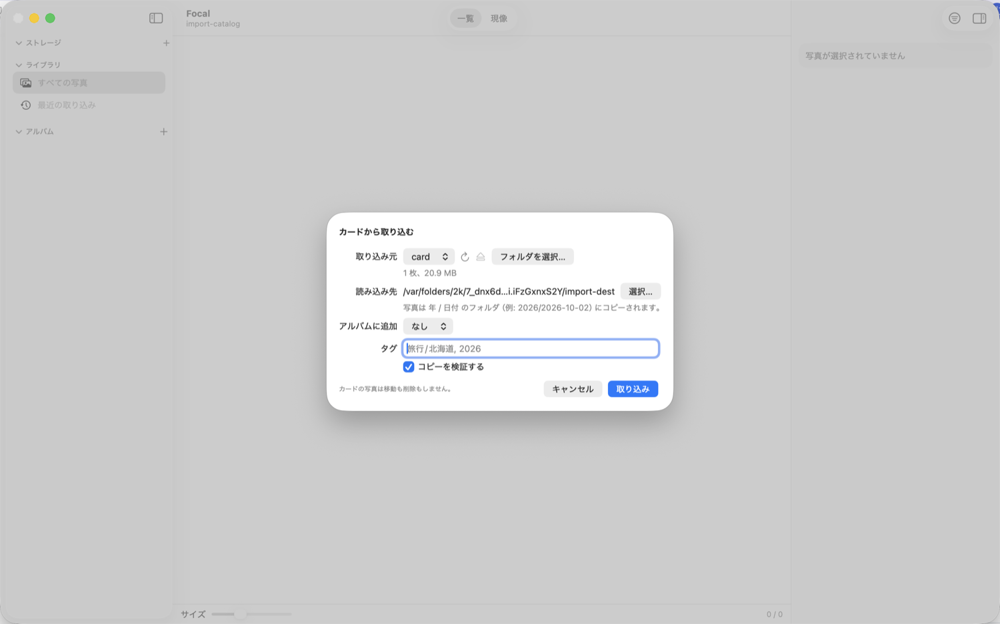

**どのように保存されるか**

```text
<読み込み先>/2026/2026-10-02/DSC00001.ARW
                              DSC00001.JPG     ← 同じ名前の JPEG やサイドカーも一緒に
```

- 日付は撮影日時（EXIF の撮影時刻）です。撮影日時が読めないもの（JPEG だけ・動画など）は、ファイルの更新日時で決め、結果に「推定」と出ます。
- RAW + JPEG のペア、カメラが作るサイドカー（`.xmp` など）、動画も、同じ名前のものは一緒にコピーします。**カタログに写真として登録されるのは RAW だけ**です。
- **取り込み済みの写真は自動でスキップ**します（ファイル名・サイズ・撮影日時が同じものが、カタログかコピー先にある場合）。同じカードを何度取り込んでも増えません。
- 同じ名前の**別の**ファイルがあるときは、上書きせず `DSC00001_1.ARW` のように連番を付けます。
- コピーは一度一時ファイルに書き、確認してから本来の名前にします。途中で止まっても、中途半端なファイルは残りません。コピー先の**空き容量が足りないときは、コピーを始める前に止まります**。
- **カードの写真は移動も削除もしません。**
- 終わったら、「取り込んだ写真を表示」で、取り込んだ写真だけの一覧（サイドバーの「最近の取り込み」）が開きます。
- 取り込み中にアプリを終了すると、取り込みを止めてから終了します（コピー済みの分は登録されます）。

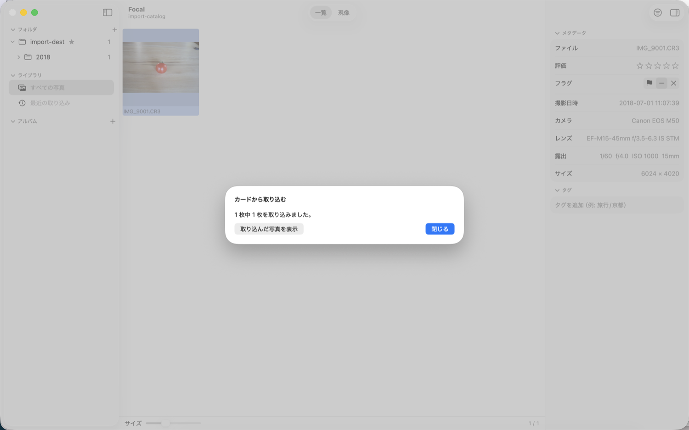

> コピー先（読み込み先）は、設定の「読み込み先」か、ストレージのルートの右クリック ▸「読み込み先にする」で決めておけます。

---

## 4. 写真を整理する

### グリッド（一覧）

- 写真は撮影日時の順に並びます。ツールバー下部のスライダーでサムネイルの大きさを変えられます。
- ←→↑↓ で移動、クリックで選択、⇧クリックで範囲選択、⌘クリックで追加選択です。
- ダブルクリックまたは `Return`、`V` で現像に入ります。

### 評価（★）とフラグ

| 操作 | キー |
|---|---|
| ★ を付ける（0 で解除） | `0`〜`5` |
| ピック | `P` |
| リジェクト | `X` |
| フラグを解除 | `U` |

写真メニューやインスペクタからも設定できます。複数選択して一括で付けられます。

### タグ

インスペクタの「タグ」に、`旅行/北海道` のように `/` で区切って入力すると、**階層のタグ**になります。1 枚の写真に複数のタグを付けられます。タグの外し方は、インスペクタのタグの×です。

### 絞り込み

ツールバーの「絞り込み」（⌥⌘F）で絞り込みバーを開きます。

| 条件 | 内容 |
|---|---|
| 評価 | ★ いくつ以上か |
| フラグ | ピック／リジェクトでない／フラグなし／リジェクト |
| 撮影日 | 期間（開始日〜終了日） |
| フォルダ | 階層から選ぶ（サブフォルダを含む） |
| タグ | 階層から選ぶ（子のタグを含む） |

条件は、サイドバーで選んだ集まり（フォルダやアルバム）に**重ねて**効きます。バーを閉じていても、絞り込み中はツールバーに条件の要約と解除ボタンが出ます。

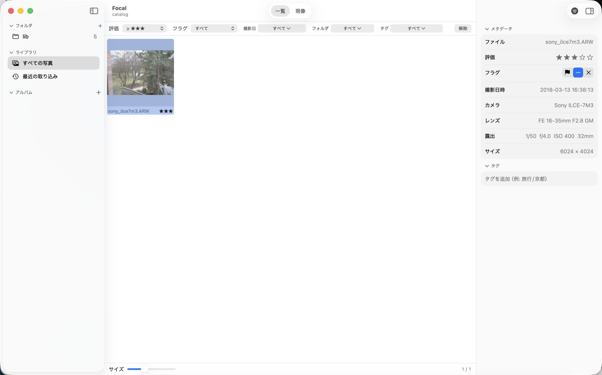

### アルバム

アルバムは、あなたが**手で集めた**写真のまとまりです。**1 枚の写真を複数のアルバムに入れられます**。アルバムを消しても写真は消えません。

- **作る**: サイドバー「アルバム」見出しの **＋** ▸ 新規アルバム、またはファイル ▸ **新規アルバム…**（⇧⌘N）。選択中の写真を入れて作るときは、写真メニュー ▸「選択した写真で新規アルバム…」。
- **写真を入れる**: グリッドの写真を、サイドバーのアルバムへ**ドラッグ&ドロップ**します。または、写真メニュー ▸ **アルバムに追加**。
- **写真を外す**: アルバムを表示中に、写真メニュー ▸ **アルバムから外す**（写真は消えません）。
- **カバー写真**: アルバムの行には、先頭の写真の小さなサムネイルが出ます。別の写真にしたいときは、アルバムを表示して写真を選び、写真メニュー ▸ **アルバムのカバーにする**。
- **名前の変更・移動・並べ替え・削除**: アルバムを右クリックします。

| メニュー | 内容 |
|---|---|
| 名前の変更… | |
| 移動先 | フォルダの中へ／最上位へ |
| 上へ移動／下へ移動 | 同じ階層の中で順番を入れ替え |
| アルバムを削除… | 写真は消えません |

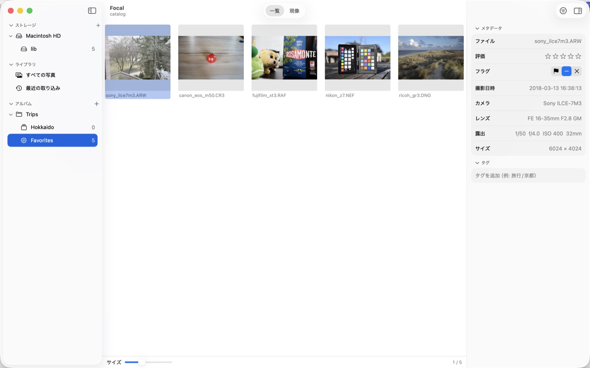

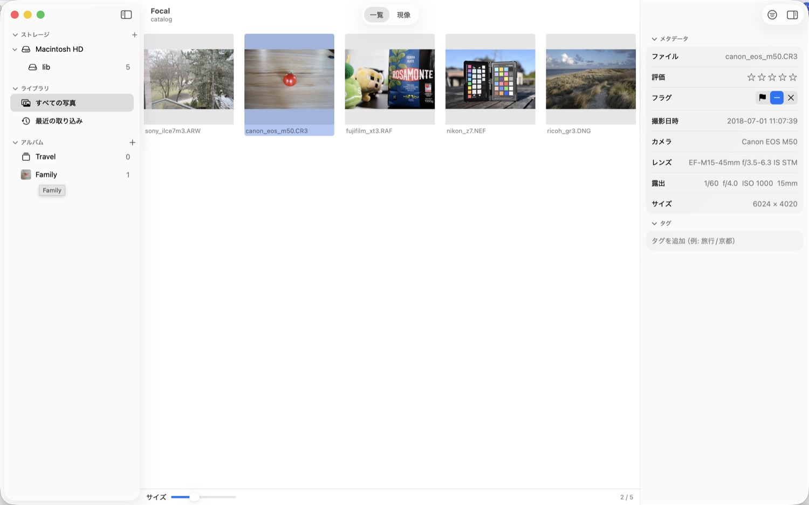

### フォルダ（アルバムの入れ物）

アルバムを**フォルダ**に入れて整理できます（入れ子にできます）。

- **作る**: 「アルバム」見出しの ＋ ▸ **新規フォルダ…**、またはフォルダの右クリック ▸ ここに新規アルバム／スマートアルバム／フォルダ。
- **入れる**: アルバムやフォルダを、サイドバーでフォルダの行に**ドラッグ&ドロップ**します（右クリック ▸「移動先」でも）。「アルバム」見出しにドロップすると、いちばん上に戻ります。
- フォルダ自体は写真を持たないので、選んで表示することはできません（中のアルバムを選びます）。
- **フォルダを削除すると、中のアルバムも一緒に削除**されます（写真は消えません）。

### スマートアルバム

**スマートアルバム**は、「評価が ★4 以上で、このフォルダの写真」のような**保存した検索条件**です。条件に合う写真が自動で集まります。

- 作る: 「アルバム」見出しの ＋ ▸ **新規スマートアルバム…**（⌥⌘N）。編集は右クリック ▸ **スマートアルバムを編集…**。
- 写真を**手で入れることはできません**（読み取り専用）。
- 条件は「**すべて**を満たす」（AND）か「**いずれか**を満たす」（OR）で結びます。使える条件は次のとおりです。

| 項目 | 指定できる内容 |
|---|---|
| 評価 | ★ の数（以上／以下／ちょうど） |
| フラグ | ピック／リジェクト／フラグなし（である／でない） |
| タグ | 指定のタグ（子孫を含む）を持つ／持たない |
| アルバム | 指定のアルバム（フォルダなら中のアルバムも）に含まれる／含まれない |
| フォルダ | 指定のフォルダ（サブフォルダを含む）にある／ない |
| カメラ / レンズ / ファイル名 | 文字列を含む／含まない |
| ISO / 焦点距離 / 絞り | 数値（以上／以下／ちょうど） |
| 撮影日 | 以降／以前／期間 |

例: 「アルバム『旅行』に含まれ、かつ ★4 以上」「タグ `風景` を持ち、リジェクトでない」。

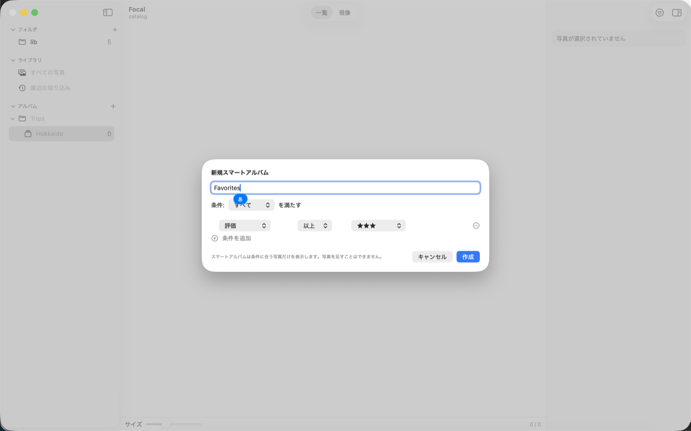

### 最近の取り込み

サイドバーの「最近の取り込み」は、**最後に写真を足した取り込み**で増えた写真を出します。写真を 1 枚も足さなかった再スキャンでは変わりません。

---

## 5. 現像する

現像に入るには、写真を選んで `V`（または ⌘2、ダブルクリック、`Return`）を押します。もう一度 `V` か `Esc` で一覧に戻ります。

### 表示

- **フィット**（画面に収める）と **100%**（1 画像ピクセル = 1 画面ピクセルの等倍）を、`Z` で切り替えます。100% はクリックした位置を中心に拡大します。
- 画面下のフィルムストリップで、同じ集まりの写真をすばやく切り替えられます（⌥⌘B で隠せます）。
- ←→ で前後の写真へ移動します。次の写真は先読みするので、すぐ開きます。
- インスペクタの上部に**ヒストグラム**（固定）と、フィット／100%・切り取り・90° 回転のボタンがあります。

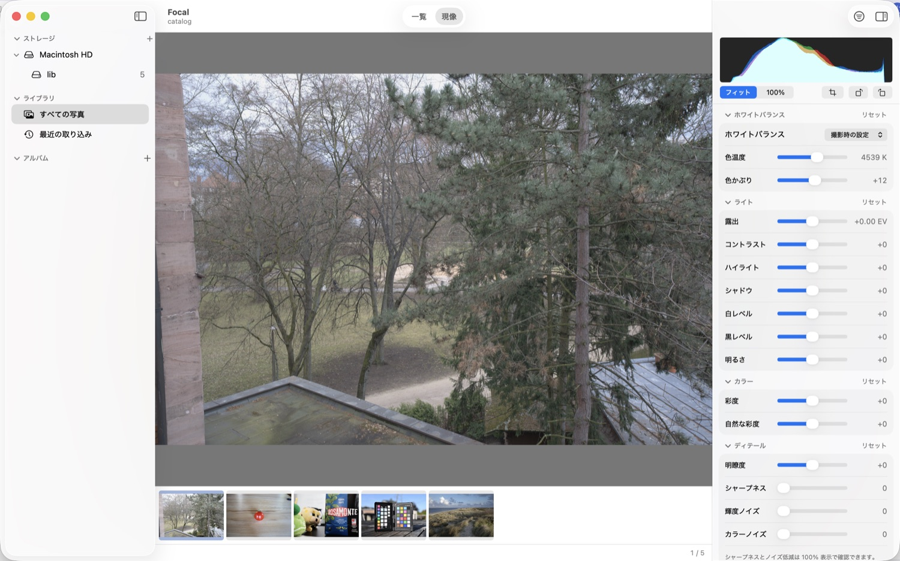

### 現像の操作

インスペクタの区分（ホワイトバランス・ライト・カラー・ディテール）は、見出しをクリックして開閉できます（開閉の状態は保存されます）。

**スライダーの使い方**

- ドラッグで調整します。**ダブルクリックで既定値に戻ります**。各区分の「リセット」で、その区分をまとめて戻せます。
- スライダーを動かすと、すぐに画面に反映されます。ドラッグの 1 回が、Undo の 1 回分です。

**ホワイトバランス**

| 項目 | 範囲 | 内容 |
|---|---|---|
| 撮影時の設定 / カスタム | | 撮影時の設定（既定）か、自分で決めた色温度・色かぶりか |
| 色温度 | 約 2000〜50000 K | 青っぽい〜黄色っぽい |
| 色かぶり | -150〜+150 | 緑〜マゼンタ |

撮影時の設定のままスライダーを動かすと、撮影時の値から始めて「カスタム」に切り替わります（1 回の Undo）。色温度・色かぶりをダブルクリックすると撮影時の設定に戻ります。

**ライト**

| 項目 | 範囲 | 内容 |
|---|---|---|
| 露出 | -5.0〜+5.0 EV | 全体の明るさ |
| コントラスト | -100〜+100 | 明暗の差 |
| ハイライト | -100〜+100 | 明るい部分だけ |
| シャドウ | -100〜+100 | 暗い部分だけ |
| 白レベル | -100〜+100 | 明部の端（いちばん明るい側）の位置 |
| 黒レベル | -100〜+100 | 暗部の端（いちばん暗い側）の位置 |
| 明るさ | -100〜+100 | 白と黒の端を動かさずに、中間調の明るさを変える |

**カラー**

| 項目 | 範囲 | 内容 |
|---|---|---|
| 彩度 | -100〜+100 | 色の鮮やかさ（すべての色に同じ強さ） |
| 自然な彩度 | -100〜+100 | 鮮やかでない色を中心に調整 |

**ディテール**

| 項目 | 範囲 | 内容 |
|---|---|---|
| 明瞭度 | -200〜+200 | 局所的な明暗（中間調の立体感）。プラスで力強く、マイナスでやわらかく |
| シャープネス | 0〜150 | 細部の輪郭 |
| 輝度ノイズ | 0〜100 | ざらつき（明暗のノイズ）を減らす |
| カラーノイズ | 0〜100 | 色のにじみ・色ノイズを減らす |

> シャープネスとノイズ低減は、**100% 表示と書き出しで効き方が見えます**。フィット表示では細部が縮小されるため、変化が分かりにくいことがあります。

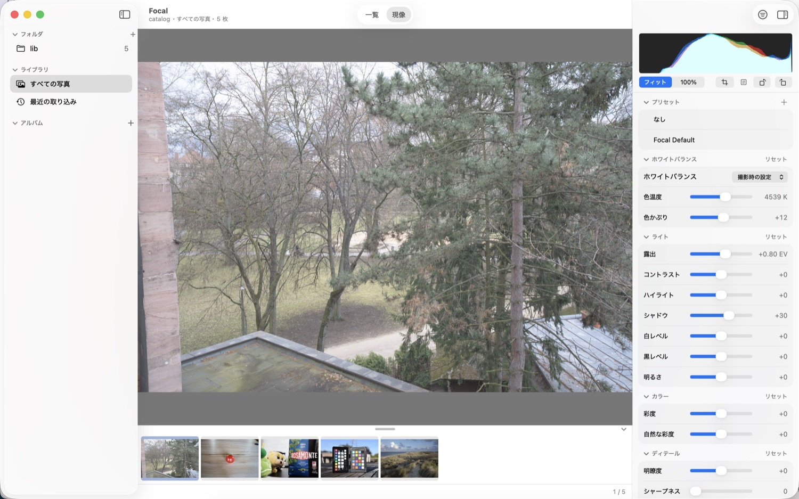

### 切り取り・回転・傾き補正

`C` キー、またはインスペクタ上部の「切り取り」で、**切り取りモード**に入ります。

- 枠の角や辺をドラッグして切り取ります。**縦横比**は、自由・元の比率・1:1・3:2・4:3・16:9・5:4 から選べます。まだ切り取っていない写真は、最初は**元の比率**が選ばれています（自由に切り取るときは「自由」に変えます）。
- **傾き補正**（-45°〜+45°）はスライダーで。切り取りの枠は、余白が出ない最大の枠に自動で合わせます。
- **水平線ツール**（「水平線」）: 水平（または垂直）にしたい線に沿ってドラッグすると、その角度を打ち消す傾き補正になります。
- **90° 回転**: `[`（左）と `]`（右）、またはボタン。切り取りの枠も一緒に回ります。
- `C` か `Return`、「完了」で確定、`Esc`・「キャンセル」で取り消し（入る前の状態に戻ります）。確定までが Undo の 1 回分です。

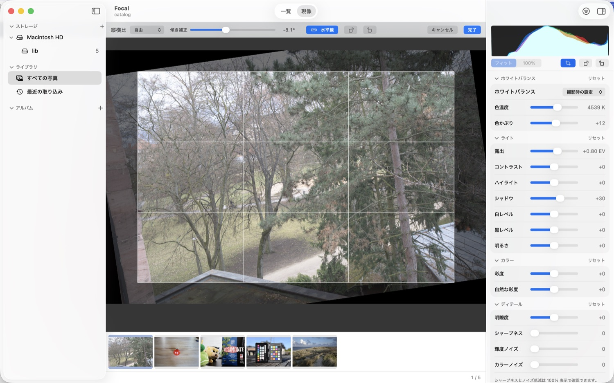

### 取り消し・やり直し

- **⌘Z** で取り消し、**⌘⇧Z** でやり直しです（編集メニューにもあります）。
- 取り消しの履歴は**直近の 20 枚分**の写真ごとに持ちます。**Focal を終了すると履歴は消えます**（現像の設定そのものは保存されます）。
- 評価・フラグ・タグ・アルバムの操作は、取り消しの対象ではありません。

### 編集の保存

現像の設定は、操作のあと自動でカタログに保存されます（手動の保存は要りません）。写真を閉じるとき・アプリを終了するときにも保存します。**元の RAW ファイルは変更されません。**

編集した写真は、一覧のサムネイルにも現像の結果が反映されます。

---

## 6. 書き出す

現像した写真を、JPEG や TIFF のファイルとして書き出します。

1. 書き出す写真を選びます（複数選択できます。選んでいなければ、表示中の 1 枚）。
2. ツールバーの「書き出し」、またはファイル ▸ **書き出し…**（⇧⌘E）。
3. 設定して「書き出す」を押します。

| 項目 | 内容 |
|---|---|
| 形式 | **JPEG**（sRGB、8-bit）／ **TIFF 16-bit**（sRGB） |
| 品質（JPEG） | 50〜100（既定 92） |
| サイズを変更 | オンにすると、長辺を指定した画素数に縮小します（高品質の縮小）。オフなら原寸 |
| 保存先 | 書き出し先のフォルダ。次回も覚えています |

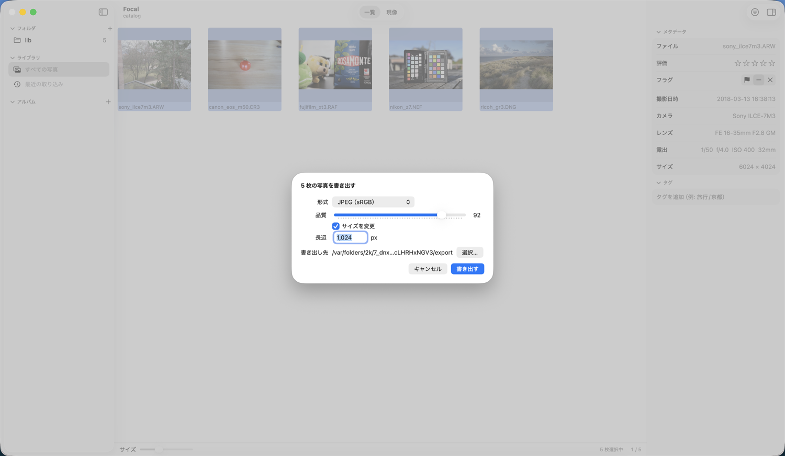

- 保存済みの現像の設定が反映されます。
- ファイル名は `元の名前.jpg`（TIFF は `.tif`）です。**同じ名前があっても上書きせず**、`_1`、`_2` … を付けます。
- sRGB のプロファイル（ICC）を埋め込みます。撮影情報（EXIF）は、現在の版では書き出しファイルに付きません。
- 複数枚は 1 枚ずつ順に書き出し、進み具合が出ます。「停止」で途中でやめられます。失敗した写真があっても、残りは続けて書き出します。

---

## 7. 写真を削除する

> **この操作は、ディスク上の写真ファイルを削除します。** 普通の操作では起きないよう、特別なキー操作にしてあります。

### 削除の方法

選択した写真を、次のどちらかで削除します。

- キー: **⌥⌃⇧ Delete**（Option + Control + Shift + Delete）
- メニュー: **⌥⌃ を押しながら**写真メニューを開き、「ゴミ箱に移動…」を選ぶ（⌥⌃ を押さずに開くと、この項目は選べません）

`Delete` だけ、⌘ + Delete、⌥ + Delete では何も起きません。

どちらの場合も、**確認ダイアログ**が出ます。内容をよく読んでから、赤いボタンを押してください。

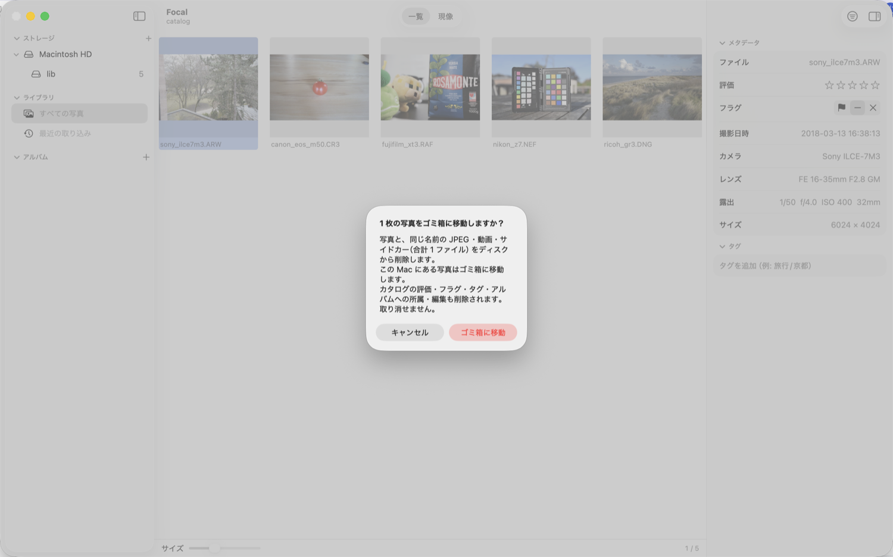

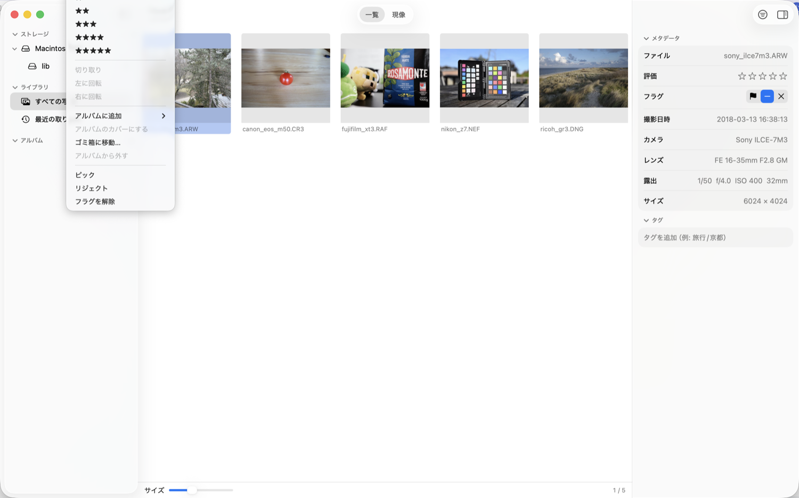

### 何が消えるか

- その写真の RAW と、**同じフォルダで同じ名前の** JPEG・動画・サイドカー（`.xmp` など）。別の名前のファイルには触れません。
- カタログの★・フラグ・タグ・アルバムへの所属・現像の設定も消えます。
- 取り消し（Undo）はできません。

### ゴミ箱に入るもの・入らないもの

| 写真のある場所 | 動作 |
|---|---|
| この Mac のディスク | **ゴミ箱に移動**します（ゴミ箱から戻せます。戻したファイルは、再スキャンで写真として復活しますが、★・タグ・現像の設定は戻りません） |
| ネットワークボリューム（NAS） | ゴミ箱が使えないことが多いため、**即座に完全に削除**します。確認ダイアログに「ゴミ箱から戻せない」ことと、その枚数が出ます |

### うまくいかなかったとき

ファイルを消せなかった写真は、**ファイルもカタログも残し**、結果を知らせます。RAW を消せたあとに JPEG だけ消せなかったときは、写真は消え、失敗したファイルを知らせます。

> アルバムから写真を**外すだけ**にしたいときは、削除ではなく、写真メニュー ▸「アルバムから外す」を使ってください。

---

## 8. キーボードショートカット一覧

### 写真の操作

| キー | 動作 |
|---|---|
| ← → ↑ ↓ | 写真の移動 |
| `V` | 一覧 ⇄ 現像 |
| `Return`、ダブルクリック | 現像に入る |
| `0`〜`5` | ★ の設定（0 で解除） |
| `P` / `X` / `U` | ピック / リジェクト / フラグ解除 |
| ⌥⌃⇧ Delete | 選択した写真をディスクから削除（確認あり） |

### 現像

| キー | 動作 |
|---|---|
| `Z` | フィット ⇄ 100% |
| `C` | 切り取りモードの開始・確定 |
| `Esc` | 切り取りの取り消し／一覧に戻る |
| `[` / `]` | 左 / 右に 90° 回転 |
| ⌘Z / ⌘⇧Z | 取り消し / やり直し |

### メニュー

| キー | 動作 |
|---|---|
| ⌘O | フォルダを追加 |
| ⌥⌘O | カタログを開く |
| ⇧⌘N | 新規アルバム |
| ⌥⌘N | 新規スマートアルバム |
| ⇧⌘I | カードから取り込む |
| ⇧⌘R | すべてのフォルダを再スキャン |
| ⇧⌘E | 書き出し |
| ⌘1 / ⌘2 | 一覧 / 現像 |
| ⌥⌘F | 絞り込みバーの表示 / 非表示 |
| ⌥⌘B | フィルムストリップの表示 / 非表示 |
| ⌥⌘I | インスペクタの表示 / 非表示 |
| ⌘, | 設定 |

> タグ名などの文字を入力している間は、`P` `X` などの単キー操作は効きません（入力が優先されます）。

---

## 9. 設定

アプリメニュー ▸ **設定…**（⌘,）。

| 項目 | 内容 |
|---|---|
| 外観 | システムに合わせる／ライト／ダーク |
| 表示の処理 | 現像の表示を描くのが GPU か CPU かの表示（書き出しは常に CPU） |
| 取り込み | **Focal を開くときにフォルダを再スキャンする**（オン／オフ）、**読み込み先**（カード取り込みのコピー先） |
| カタログ | いま開いているカタログの場所 |
| プレビューキャッシュ | 最大サイズ（512MB〜20GB）、使用量、キャッシュを削除、場所 |
| サムネイルキャッシュ | 場所 |

ヘルプメニューの「サードパーティのライセンス」で、同梱しているライブラリのライセンスを確認できます。

---

## 10. 機能一覧・制限事項

### できること

| 分類 | 機能 |
|---|---|
| ライブラリ | フォルダの登録（参照方式）、再スキャン、ボリューム（外付け・NAS）の追従とオフライン表示、グリッド表示、カタログの新規作成・切り替え |
| 取り込み | SD カードなどから日付フォルダへコピー（検証・重複スキップ・空き容量の確認つき） |
| 整理 | ★0〜5、ピック／リジェクト、階層タグ、絞り込み（評価・フラグ・撮影日・フォルダ・タグ）、アルバム（複数所属、フォルダで入れ子）、スマートアルバム、最近の取り込み |
| 現像 | 露出、コントラスト、ハイライト、シャドウ、白レベル、黒レベル、明るさ、ホワイトバランス（色温度・色かぶり）、彩度、自然な彩度、明瞭度、シャープネス、ノイズ低減（輝度・カラー） |
| ジオメトリ | 切り取り（縦横比の固定可）、90° 回転、傾き補正（±45°）、水平線ツール |
| 表示 | フィット／100%、ヒストグラム、フィルムストリップ |
| 編集 | 取り消し／やり直し（直近 20 枚分、起動中のみ）、非破壊（元ファイルは変更しない） |
| 書き出し | JPEG（sRGB）、TIFF 16-bit、長辺リサイズ、複数枚、上書きしない名前の付け方 |
| 削除 | ⌥⌃⇧ Delete でディスクから削除（ゴミ箱／NAS は完全削除、確認あり） |
| その他 | 日本語・英語の表示、ライト／ダーク |

### まだできないこと（この版）

- ルーペ（部分拡大鏡）、2 枚を並べて比較する表示
- 仮想コピー（同じ写真の別バージョン）、スタック
- ローカル補正（ブラシ・グラデーション）、レンズ補正、かすみの除去、HSL（色ごとの調整）、トーンカーブ、ビネット
- XMP サイドカーへの書き出し、書き出しファイルへの EXIF の付加
- JPEG だけの写真の管理（コピーはされますが、一覧には出ません）
- アルバムの中の写真の手での並べ替え
- HDR（EDR）表示
- Windows・Linux 用のアプリ画面（現在は macOS のみ）

---

## 11. 困ったときは

**写真が「ファイルなし」と表示される**
元のファイルが見つかりません。ファイルを動かした・消した場合は、元に戻すか、再スキャンしてください（別のフォルダへ動かしたものは、名前・サイズ・撮影日時が同じなら自動でつなぎ直されます）。ドライブが外れているときは、「ファイルなし」ではなくグレーのオフライン表示になります。つなぎ直せば戻ります。

**外付けドライブ・NAS のフォルダがグレーになる**
接続されていません。ドライブをつなぎ直してください。数秒で自動で戻ります。戻らないときは、ストレージのルートを右クリック ▸「再スキャン」を試してください。

**カードを挿してもサイドバーに「取り込み」が出ない**
カードに `DCIM` フォルダがない場合は検出されません。取り込みのシート（⇧⌘I）の「フォルダを選択…」で、カードやその中のフォルダを手で選べます。

**取り込みが「取り込み済み」でスキップされる**
ファイル名・サイズ・撮影日時が同じ写真が、すでにカタログかコピー先にあります。意図的に取り込み直したいときは、先にその写真を削除してください。

**現像の結果が、ほかのソフトと少し違って見える**
Focal は、RAW の現像を独自の処理で行います。同じ写真でも、他のソフトの「撮影時の設定」とは見た目が一致しないことがあります。

**書き出した JPEG に撮影情報（EXIF）が付かない**
現在の版の仕様です（書き出しには付けません）。

**カタログを新しい版で開いたら、古い版で開けなくなった**
カタログの形式が新しくなったためです。古い版に戻したいときは、カタログのパッケージの中にある、更新前の自動バックアップ（`catalog.sqlite.v〜.bak`）を使ってください。

**写真を誤って削除した**
この Mac のディスクの写真は、ゴミ箱に入っています。Finder のゴミ箱から元の場所に戻し、Focal で再スキャンしてください（★・タグ・現像の設定は戻りません）。NAS の写真は完全に削除されるため、戻せません。

---

*画面の写真は、動作確認用の公開サンプル（raw.pixls.us、CC0）です。*

*本ガイドは Focal の設計書（`design.md`）と実装に基づいて書いています。操作や画面の表記が実際と異なる場合は、お知らせください。*
