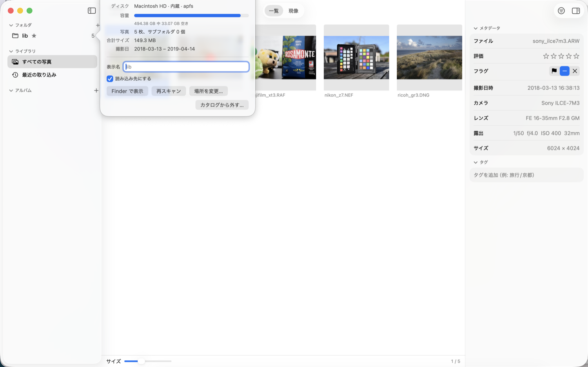

# Focal 使い方ガイド

Focal は、RAW 写真の管理と現像を 1 つでこなす、軽量な Mac アプリです（JPEG・TIFF・PNG・HEIF の写真も管理できます。現像できるのは RAW のみ）。写真は元の場所にあるファイルをそのまま参照し（編集内容はカタログに保存）、元の RAW ファイルに直接変更を加えることは一切ありません（非破壊編集）。

- 動作環境: macOS 14（Sonoma）以降、Apple シリコンの Mac
- 画面の表示言語: 日本語・英語（macOS の言語設定に従います）

> **ご利用にあたって**: Focal は開発中のソフトウェア（ベータ版）です。写真のファイルやカタログの内容が失われる不具合が含まれている可能性があります。**大切な写真は、必ずバックアップを取ったうえでお使いください。** 特に、写真を削除する機能（⌥⌃⇧ Delete）は、ディスクからファイルを削除します（「7. 写真を削除する」）。本ソフトウェアの使用によって生じた損害について、開発者は責任を負いません（Apache License 2.0）。

> このガイドは、Focal 26.0.0 β に合わせています。機能の仕様の詳細は、[設計書（design.md）](https://github.com/ayumu-bekki/focal/blob/main/design.md) を参照してください。

## 目次

1. [はじめに](#1-はじめに)
2. [カタログの管理](#2-カタログの管理)
3. [写真を取り込む](#3-写真を取り込む)
4. [写真を整理する](#4-写真を整理する)
5. [現像する](#5-現像する)
6. [書き出す](#6-書き出す)
7. [写真を削除する](#7-写真を削除する)
8. [キーボードショートカット一覧](#8-キーボードショートカット一覧)
9. [設定](#9-設定)
10. [機能一覧・制限事項](#10-機能一覧制限事項)
11. [困ったときは](#11-困ったときは)

---

## 1. はじめに

### 画面の構成

```text
┌────────────────────────────────────────────────────────────┐
│ ツールバー: [ 一覧 | 現像 ]            [絞り込み] [書き出し] [ⓘ] │
├──────────┬──────────────────────────────────┬──────────────┤
│ サイドバー │  メイン                           │ インスペクタ   │
│ フォルダ   │  一覧: 写真のグリッド              │ ヒストグラム   │
│ ライブラリ │  現像: 写真 + フィルムストリップ    │ 現像の操作     │
│ アルバム   │                                  │ メタデータ・タグ│
└──────────┴──────────────────────────────────┴──────────────┘
```

- **一覧**と**現像**は、ツールバー中央のスイッチ（⌘1 / ⌘2、または `V` キー）で切り替えます。
- **サイドバー**では、表示したい写真の集まり（追加したフォルダ・すべての写真・アルバムなど）を選択します。
- **インスペクタ**（画面右側）は ⌥⌘I で開閉できます。ヒストグラム、現像スライダー、メタデータ（写真の情報）、タグが並びます。
- **絞り込みバー**は、ツールバーの「絞り込み」ボタン（⌥⌘F）で上部に表示／非表示を切り替えます。


### 初めて起動したとき

初回起動時には「Focal へようこそ」画面が表示されます。

1. **カタログを作成** をクリックすると、既定の場所（`~/Pictures/Focal/Focal Catalog.focalcatalog`）にカタログが作成されます（別の保存場所を指定することも可能です）。すでにカタログがある場合は「既存のカタログを開く…」を選択します。
2. 「フォルダを追加…」で、写真の入ったフォルダを選択します。写真がスキャンされ、グリッドに一覧表示されます。

次回以降は、前回開いていたカタログが自動的に開きます。


---

## 2. カタログの管理

### カタログとは

**カタログ**は、写真の一覧と、付与したメタデータ（評価・フラグ・タグ・アルバム）、現像設定を記録するデータベースです。

- 実体は `〜.focalcatalog` という 1 つのファイル（パッケージ）で、Finder からダブルクリックで開けます。
- **写真そのものはカタログに含まれません。** 写真は元の場所にあるファイルをそのまま「参照」します（コピーも移動もしません）。そのため、カタログを削除しても写真ファイル自体が消えることはありません。逆に、写真を Finder などで直接削除・移動した場合は、カタログとの整合性を保つために Focal で「再スキャン」を実行します。
- 現像設定は元の RAW ファイルには書き込まれず、カタログにのみ保存されます。別の Mac で同じ現像設定や状態を再現したい場合は、カタログファイルも一緒に移行してください。

### カタログを新規作成する・開く・切り替える

ファイルメニューから操作します。

| 操作 | 方法 |
|---|---|
| 新しいカタログを作る | ファイル ▸ **新規カタログ…** |
| 別のカタログを開く | ファイル ▸ **カタログを開く…**（⌥⌘O）、または Finder で `〜.focalcatalog` をダブルクリック |

別のカタログに切り替える際は、編集中の現像設定を保存してから新しいカタログを開きます。ウィンドウのタイトルバー（サブタイトル）には、現在開いているカタログの名前が表示されます。

> カタログの保存場所は、設定（⌘,）の「カタログ」タブで確認できます。

### アップデート時の自動バックアップ

Focal の新しいバージョンでカタログの形式（スキーマ）が変わる場合は、**変更前に自動でバックアップ**を作成します（カタログパッケージ内の `catalog.sqlite.v〈旧版〉-〈日時〉.bak`）。アップデート後に問題が生じた場合は、このファイルから元の状態に戻せます。なお、**古いバージョンの Focal では、新しい形式のカタログを開くことはできません**。

### フォルダを追加する（ライブラリのルート）

サイドバー「フォルダ」見出しの **＋** ボタン、またはファイル ▸ **フォルダを追加…**（⌘O）で、写真の入ったフォルダを登録します。

- 登録したフォルダを**ルート**と呼びます。ルート内のサブフォルダもすべてスキャンされ、取り込まれます（隠しフォルダ・隠しファイルは対象外）。
- `.photoslibrary`（Apple「写真」のライブラリ）、`.aplibrary`（Aperture）、`.lrdata`（Lightroom のプレビュー）などのパッケージ内は**走査しません**。`~/Pictures` を登録しても、「写真」ライブラリの中身が取り込まれることはありません（Focal は「写真」アプリのライブラリを直接読み込みません）。
- 登録される写真は、RAW に加えて、**JPEG（`jpg` `jpeg`）・TIFF（`tif` `tiff`）・PNG（`png`）**、macOS では **HEIF（`heic` `heif`）** も対象です（詳しくは後述の「RAW 以外の写真」を参照）。RAW は、拡張子が `3FR` `ARW` `CR2` `CR3` `CRW` `DCR` `DNG` `ERF` `FFF` `GPR` `IIQ` `KDC` `MEF` `MOS` `MRW` `NEF` `NRW` `ORF` `PEF` `RAF` `RAW` `RW2` `RWL` `SR2` `SRF` `SRW` `X3F` のファイルに対応しています（Canon・Nikon・Sony・Fujifilm・Olympus・Panasonic・Pentax・Ricoh・Leica・Hasselblad・Phase One・Sigma・Samsung などのカメラ。読み込みは LibRaw）。破損などで読み込めないファイルは「非対応」として扱われます。
- スキャンの進行状況は、画面上部に表示されます。
- **すでに登録済みのフォルダに含まれるサブフォルダ**を追加した場合は、新たなルートは作成されず、既存のサブフォルダが選択されて画面上部に「登録済みのフォルダです」とトースト通知が表示されます（現像設定などはそのまま保持されます）。
- **登録済みフォルダの上位階層（親フォルダ）**を追加した場合は、以前のフォルダが新しいルートに**統合**されます。★・フラグ・タグ・現像設定はすべて引き継がれます（統合前に自動で安全バックアップを作成します）。
- 旧バージョンで誤って入れ子に登録されていたカタログは、起動時に「統合しますか？」と確認ダイアログが表示されます。「統合」を選択すると、同一写真の情報が 1 つにまとめられます。

### サイドバーの「フォルダ」

**追加したフォルダ（ルート）**が一覧で並びます（ディスクの絶対パス階層ではなく、登録フォルダを起点として表示されます）。フォルダ内のサブフォルダは、行の左の ▶ をクリックして展開できます。

```text
▼ フォルダ                 ＋
   ▼ Photos        1,230   ← 追加したフォルダ
      ▶ 2026
   ▶ Archive         (グレー) ← 切断中の外付けドライブや NAS のフォルダはグレー表示（オフライン）
```

- フォルダの行にカーソルを合わせると、場所（パス）とディスク（ボリューム）の名前がツールチップで表示されます。
- **★** が付いたフォルダは、カード取り込み時の**読み込み先**です（右クリック ▸「読み込み先にする」、設定画面、または取り込みシートで変更可能）。読み込み先は**カタログごと**に個別に記憶されます。
- フォルダを選択すると、そのフォルダ（サブフォルダを含む）の写真のみが一覧表示されます。
- 追加したルートフォルダ（最上位階層）を右クリックすると、以下の操作が行えます。

| メニュー | 内容 |
|---|---|
| 再スキャン | そのルートフォルダをスキャンし直します |
| 情報を見る… | フォルダの情報を表示します（下記参照） |
| 読み込み先にする | カード取り込みの保存先に設定します（現在の読み込み先には ✓ が付き、行に ★ が表示されます） |
| Finder で表示 | フォルダを Finder で開きます |

### フォルダの情報

追加したルートフォルダを右クリックして「**情報を見る…**」を選択すると、そのフォルダの詳細情報がポップオーバーで表示されます。



| 項目 | 内容 |
|---|---|
| 場所 | フォルダのパス（選択してコピー可能） |
| 状態 | 接続中／オフライン（外付けドライブや NAS が切断されている場合） |
| ディスク | ディスク名、種類（内蔵・外付け・ネットワーク）、ファイルシステム、マウント位置 |
| 容量 | ディスクの空き容量と全体容量 |
| 写真 | 登録写真の枚数、サブフォルダ数、ファイルが見つからない（行方不明の）枚数 |
| 編集・評価あり | 現像・★・フラグ・タグのいずれかが設定されている写真の枚数（カタログから外した際に保管対象となる情報の目安） |
| 合計サイズ・撮影日 | 写真ファイルの合計サイズ、撮影日時の範囲 |
| 表示名 | サイドバーでの表示名（未指定の場合は実際のフォルダ名） |
| 読み込み先にする | オンにすると、カード取り込み時のコピー先になります（★） |
| 場所を変更… | フォルダを移動した際やドライブを換装した際に、登録パスを新しいフォルダへ再割り当てします（★・タグ・現像設定は保持されます） |

ポップオーバー下部のボタンから、Finder での表示・再スキャン・場所の変更が行えます。「カタログから外す」は誤操作を防ぐため、右クリックメニューには配置せず、この詳細画面の最下部にのみ配置しています。オフラインのフォルダではディスク容量などは表示されず、カタログに記録されているメタデータのみが表示されます。

### RAW 以外の写真（JPEG・TIFF・PNG・HEIF）

JPEG・TIFF・PNG（macOS では HEIF / HEIC も）の写真も、RAW と同様にカタログに登録して整理できます。

- **RAW と同名の JPEG は、同一の写真（1 枚）**として扱われます。同一フォルダ内で拡張子を除いたファイル名が一致する場合（大文字・小文字は区別しません）、RAW が主写真となり、JPEG は**付属ファイル**として紐付けられます（グリッド上には RAW の 1 枚のみが表示され、情報パネルの「付属ファイル」に JPEG 名が表示されます）。★・フラグ・タグ・アルバム・現像設定は、1 枚の写真として一元管理されます。
- RAW を伴わない JPEG・TIFF・PNG・HEIF は、それぞれ独立した写真として扱われます（同名であっても `a.jpg` と `a.png` は別々の写真です）。
- **現像はできません**。現像調整が行えるのは RAW のみです。RAW 以外の写真を選択した際は、右ペインの現像セクション・切り取り・回転・プリセットが無効化され、その旨の案内が表示されます。グリッド表示、評価（★）、フラグ、タグ、アルバム、絞り込み、書き出しはそのまま利用できます。
- ファイル構成の変化にも柔軟に対応します。JPEG のみ登録されていたフォルダに後から同名の RAW を追加すると、そのエントリが RAW 写真へと自動で切り替わります（★やタグなどの情報はそのまま引き継がれます）。逆に RAW を削除して JPEG のみが残った場合も、同じ写真エントリのまま JPEG 写真として存続します。
- 撮影日時・カメラ・レンズ・露出値はファイルの EXIF から読み取ります。EXIF を持たない画像（PNG など）は撮影日時が不明となり、日付による絞り込みの対象外となります。
- 表示時のカラーマネジメントでは、ファイルに埋め込まれた色空間（Adobe RGB など）を sRGB に変換して表示します。
- **削除（⌥⌃⇧ Delete）**: 主写真が RAW の写真を削除すると、同名の JPEG などの付属ファイルも一緒に削除されます。RAW のない独立した JPEG 写真を削除した場合は、同名の別形式の写真（`a.png` など）が巻き込まれて削除されることはありません。
- HEIF 形式への対応は **macOS 限定**です（Windows・Linux 版ではサポートされません）。

### 外付けドライブ・NAS の扱い

- 外付けドライブの取り外しや NAS の切断が発生すると、該当ボリュームはサイドバー上で**グレーのオフライン表示**になります。ツールチップに「接続されていません」と表示されます。数秒おきに接続状態を自動検知するため、ケーブルの抜け差しなども速やかに反映されます。
- オフラインの間でも、**写真が「ファイルなし（行方不明）」になることはありません**。再接続すれば元の状態に戻ります。サムネイルはキャッシュからそのまま閲覧可能です（現像など元ファイルを必要とする処理は行えません）。
- ドライブを再接続した際、**ドライブ文字やマウント位置が変わっていても**、Focal がボリューム固有の識別情報（UUID など）を認識して自動的にパスを再調整します。
- NAS（SMB・NFS）についても、共有ネットワークパスによって同一性を判別します。

### 変更を反映する（再スキャン）

Focal の外部（Finder など）で写真ファイルの追加・削除・名前変更・移動を行った場合は、**再スキャン**を実行してカタログへ反映します。

- Focal の起動時に、全ルートフォルダを自動で再スキャンします（設定画面でオフにすることも可能）。
- ファイル ▸ **すべてのフォルダを再スキャン**（⇧⌘R）、またはサイドバーのフォルダを右クリック ▸「再スキャン」により、手動でいつでも実行できます。
- 現在表示しているフォルダは常にファイルシステムの変更を監視（FSEvents）しており、変化があれば自動的に再スキャンが行われます。

再スキャン時の詳細な挙動:

| ディスク上の変化 | カタログでの扱い |
|---|---|
| 新しい RAW / 画像が増えた | 新規の写真として登録 |
| RAW が消失した（ドライブは接続中） | 「ファイルなし」と表示（★・タグ・現像設定は保持） |
| 消失していた RAW が元の場所に戻った | 元の写真として復帰 |
| 別のフォルダへ移動した | 同名・同サイズ・同撮影日時のファイルが 1 枚のみ存在する場合、**★・タグ・アルバム・現像設定を引き継いで自動で再リンク** |
| 大文字・小文字のみ名前が変更された | 同一の写真として認識 |
| ファイル内容（更新日時）が変更された | メタデータや画像を再読み込み |
| フォルダが削除された | 写真を含まないフォルダはサイドバーから自動削除（「ファイルなし」の写真が存在するフォルダは保持） |

### ルートをカタログから外す

ルートフォルダを右クリック ▸ **情報を見る…** を開き、下部の **カタログから外す…** をクリックして、確認ダイアログで承認します（誤操作を防ぐため、通常の右クリックメニューには配置していません）。

- そのルートフォルダの写真エントリがカタログから削除されます。ただし、**★・フラグ・タグ・アルバム所属・現像設定などのメタデータは「保管された情報」としてカタログ内に保持されます**。確認ダイアログには、保管対象となるデータを持つ写真の枚数が表示されます。
- **同じ写真を再度登録した場合は、保管されていた情報が自動的に復元されます。** 同じフォルダを追加し直した場合はもちろん、別フォルダへコピーしたりファイル名を変更した場合でも、ファイル内容（ハッシュとサイズ）が同一であれば復元されます（復元時、画面上部に「n 枚の保管していた編集を戻しました」と表示されます）。フォルダを移動しただけであれば、ルートを外さずに「場所を変更…」を使用すればそのままパスを付け替えられます。
- 保管された情報は、設定（⌘,）▸ **カタログ** の **最適化** を実行することで完全に削除できます（後述の「カタログ情報と最適化」を参照）。
- カタログから外す前に、カタログパッケージ内に自動で安全バックアップ（`catalog.sqlite.before-remove-root-〈日時〉-〇〇.bak`、直近 5 世代を保持）が作成されます。
- **ディスク上の実ファイルが削除されることはありません。** アルバム自体も保持されます（所属写真はいったん空になりますが、保管情報が復元されるとアルバム所属も戻ります）。
- 同一内容のファイルを別フォルダにコピーして登録した場合は、検出された時点で**元の写真の現像設定・★・フラグ・タグが複製**されます（以降は別々の写真として独立して編集可能）。元のファイルが存在しない（移動した）場合は、同一写真としてパスを再リンクします。
- 外したフォルダが**読み込み先**（★）に設定されていた場合は、登録済みの残りのフォルダの先頭が新たな読み込み先に自動設定されます（他に登録フォルダがない場合は、既定の `~/Pictures/Photos` に戻ります）。読み込み先以外のフォルダを外した場合は、設定は変更されません。

### カタログ情報・バックアップ・最適化

設定（⌘,）▸ **カタログ** タブで、現在開いているカタログの情報の確認、バックアップ、最適化が行えます。

**カタログ情報**

| 項目 | 内容 |
|---|---|
| カタログ | カタログ名と保存場所 |
| 大きさ | カタログファイルのファイルサイズ |
| フォルダ・写真 | 登録ルートフォルダ数、サブフォルダ数、写真枚数（RAW／RAW 以外）、ファイルなしの枚数、現像設定が存在する枚数 |
| アルバム / タグ | アルバム数とタグ数 |
| 操作前の安全バックアップ | フォルダ解除・統合・最適化の前に自動作成された安全バックアップ（カタログパッケージ内の `*.bak`）の個数と合計サイズ |

**バックアップ**

カタログ（現像設定・★・フラグ・タグ・アルバム情報など）を定期的に自動複製して保存する機能です。写真ファイルそのものやプレビューキャッシュは含みません。Focal を**終了する際**にバックアップ処理を実行します（Lightroom Classic と同様の動作仕様です）。

| 設定 | 内容 |
|---|---|
| カタログのバックアップ | **終了時に毎回** / 1 日ごと / 3 日ごと / **1 週間ごと（既定）** / 2 週間ごと / 1 か月ごと / 自動ではしない。「〇日ごと」を選択した場合、前回のバックアップから指定日数以上が経過していると次回終了時に実行されます |
| 終了時に、バックアップするか確認する | オンにすると、終了時に確認ダイアログが表示されます。オフにすると、確認なしで自動実行されます |
| バックアップの前に、カタログを確認する | バックアップ実行前にデータベースの整合性を検証します（既定でオン）。問題が検出された場合は処理を中止して警告します |
| 残す世代 | 直近の 3・5・**10（既定）**・20・50 個、またはすべて保持。上限を超えた古いバックアップは自動的に整理・削除されます |
| 場所 | バックアップの保存先フォルダ（既定は `~/Pictures/Focal/Backups`）。**内蔵ディスクとは別の外部ドライブなどを指定することで、ディスク障害への備えになります** |

- **終了時の動作フロー**: バックアップの実行時期に達している場合、アプリ終了時に「終了する前に、カタログをバックアップしますか？」という確認パネルが表示されます。**バックアップして終了** をクリックすると進行状況バーが表示され、完了後にアプリが終了します。**バックアップせずに終了** を選べば今回はスキップして終了し、**キャンセル** を選ぶと終了処理自体を取り消します。「次回から、確認せずに自動でバックアップする」にチェックを入れると、次回以降は確認パネルを出さずに自動でバックアップを実行します。
- **今すぐバックアップ**: 設定の「カタログ」タブから、任意のタイミングで即座にバックアップを作成できます。「最近のバックアップ」欄に日時とサイズが表示され、「Finder で表示」からファイルを確認できます。
- **バックアップはそのまま開ける完全なカタログです**: `カタログ名 YYYY-MM-DD HHMM.focalcatalog` の形式で保存されます。過去の状態に戻したい場合は、ファイル ▸ **カタログを開く…** でバックアップファイルを直接開くだけで復元できます（既存のカタログが勝手に上書きされることはありません）。
- アプリが強制終了（クラッシュ）した場合は、終了時バックアップは実行されません。

**最適化**

「保管している情報」とは、カタログから外したフォルダに属していた写真のメタデータ（現像設定・★・フラグ・タグ・アルバム所属）のうち、まだ別の写真に再リンクされていないデータです。**最適化…** を実行すると、これらの未リンク情報を完全に消去し、データベースファイルをクリーンアップしてファイルサイズを圧縮します（実行前に操作前の安全バックアップが自動作成され、削除前の確認ダイアログが表示されます）。日常的に頻繁に行う必要はありません。外したフォルダのデータが溜まりカタログサイズが肥大化した場合や、保管データを完全に破棄したい場合にご利用ください。最適化を実行した後は、外したフォルダを再登録しても以前の現像設定などは復元されません。最適化が自動で勝手に実行されることはありません。

### キャッシュ

サムネイル画像や、現像画面で一度表示した写真の高解像度プレビューは、ディスク上にキャッシュされます（`~/Library/Caches/jp.bekki.focal/`）。

- 設定（⌘,）の「キャッシュ」タブで、**プレビューキャッシュの最大サイズ**（500 MB・1 GB・2 GB・5 GB・10 GB・20 GB）の設定、現在の使用量の確認、および **キャッシュを削除** が行えます。容量上限に達した場合は、最終アクセス日時が古いプレビューから自動的に削除（LRU）されます。
- キャッシュを削除してもカタログや元の写真には影響ありません。必要に応じて次回表示時に自動で再生成されます（再生成には多少の時間がかかります）。

---

## 3. 写真を取り込む

### フォルダから取り込む

ファイル ▸ **フォルダを追加…**（⌘O）で、RAW や写真の入ったフォルダを登録するだけです。写真はコピーされず、元の保存場所のまま参照されます。

### SD カードなどから取り込む（コピーして登録）

カメラのメモリーカードから写真を読み出し、**ライブラリの保存先へコピーして**取り込みます。

1. カードを Mac に挿入します。サイドバー下部に「取り込み」項目が表示されます。または、ファイル ▸ **カードから取り込む…**（⇧⌘I）を選択します。
2. 取り込み設定シートで各項目を設定します。

| 項目 | 内容 |
|---|---|
| 取り込み元 | カード（`DCIM` フォルダのあるボリューム）を選択します。「フォルダを選択…」で任意のフォルダを手動指定することも可能です。写真の枚数と合計サイズの目安が表示されます。取り出しボタン（⏏）でカードを安全に取り出せます |
| 読み込み先 | コピー先の基準フォルダ。この配下に **年 / 日付** のサブフォルダが自動作成されて保存されます |
| アルバムに追加 | 取り込んだ写真を自動追加するアルバム（任意） |
| 現像プリセット | 取り込んだ写真に自動適用する現像プリセット（初回は同梱の「Focal Default」が選択されています。以後は前回の選択を記憶します。適用したくないときは「なし」を選択してください。詳しくは後述の「現像のプリセット」を参照） |
| タグ | 取り込んだ写真に付与するタグ（任意。`旅行/北海道, 2026` のようにカンマで区切って複数入力可能） |
| コピーを検証する | コピーした各ファイルを読み直し、BLAKE3 ハッシュによって元ファイルと完全に一致するか確かめます（既定でオン） |

3. **取り込み** をクリックします。


**ファイルの保存構造**

```text
<読み込み先>/2026/2026-10-02/DSC00001.ARW
                              DSC00001.JPG     ← 同名の JPEG やサイドカーも一緒にコピー
```

- 日付は撮影日時（EXIF の撮影時刻）に基づきます。撮影日時が取得できないファイル（一部の JPEG や動画など）はファイルの更新日時から推定され、結果一覧に「推定」と表示されます。
- RAW + JPEG のペア、カメラが生成したサイドカー（`.xmp` など）、動画ファイルも、同名のものは一緒にコピーされます。**RAW と同名の JPEG は、その RAW と同一の写真（1 枚）**として登録されます。JPEG 単体で撮影された写真（対応する RAW がないもの）も、独立した 1 枚の写真として登録されます。なお、動画ファイルはフォルダにコピーされますが、Focal の写真カタログには登録されません。
- **取り込み済みの写真は自動でスキップされます**（ファイル名・サイズ・撮影日時が同一の写真が、カタログまたはコピー先にすでに存在する場合）。同じカードから何度取り込みを実行しても、重複して登録されることはありません。
- 同名で**内容が異なる**別ファイルが既に存在する場合は、上書きせずに `DSC00001_1.ARW` のように自動で連番を付与します。
- コピー処理はいったん一時ファイルに書き出し、ハッシュ検証を行ってから本来のファイル名に変更します。処理が途中で中断しても、中途半端な破損ファイルが残ることはありません。また、コピー先の**空き容量が不足している場合は、コピー開始前に処理を中止して警告**します。
- **カード内の元写真が移動・削除されることはありません**。
- 取り込みが完了すると、「取り込んだ写真を表示」ボタンが表示され、今回取り込んだ写真の一覧（サイドバーの「最近の取り込み」）へ切り替えられます。
- 取り込み中にアプリを終了しようとした場合は、取り込み処理を安全に停止してから終了します（コピー・登録が完了した分の写真はカタログに保持されます）。


> コピー先（読み込み先）は、設定の「カタログ」タブ、またはフォルダを右クリック ▸「読み込み先にする」であらかじめ設定できます。

---

## 4. 写真を整理する

### グリッド（一覧）

- 写真は撮影日時の昇順で並びます。ツールバー下部のスライダーでサムネイルの表示サイズを自在に変更できます。
- キーボードの `←` `→` `↑` `↓` で選択を移動し、クリックで 1 枚の写真を選択します。
  - **⇧クリック**: 前回選択した写真から、クリックした写真までの**範囲**を一括選択します。続けて ⇧クリックすると、起点は維持されたまま選択範囲を伸縮できます。⇧⌘クリックを使うと、現在の選択範囲を維持したまま別の範囲を追加選択できます。
  - **⌘クリック**: 写真を 1 枚ずつ選択に追加、または選択から除外します。
  - 複数枚を選択すると、画面右下に「3 枚選択中」のように選択数が表示されます。選択した写真に対して、評価・フラグ・タグ・アルバムへの追加・書き出し・削除を一括で適用できます。
- 写真をダブルクリックするか、`Return` または `V` キーを押すと現像画面に切り替わります。

### 評価（★）とフラグ

| 操作 | キー |
|---|---|
| ★ を設定（0 で解除） | `0`〜`5` |
| ピック | `P` |
| リジェクト | `X` |
| フラグを解除 | `U` |

写真メニューやインスペクタからも設定できます。複数の写真を選択して一括で設定することも可能です。

### タグ

インスペクタの「タグ」入力欄に、`旅行/北海道` のようにスラッシュ（`/`）で区切って入力すると、**階層構造のタグ**として登録されます。1 枚の写真に複数のタグを付与できます。付与したタグを削除するには、インスペクタ内のタグにある「×」をクリックします。

### 絞り込み

ツールバーの「絞り込み」ボタン（⌥⌘F）で、画面上部に絞り込みバーを展開します。

| 条件 | 内容 |
|---|---|
| 評価 | 指定した ★ の数以上 |
| フラグ | ピック／リジェクト以外／フラグなし／リジェクト |
| 撮影日 | 期間指定（開始日〜終了日） |
| フォルダ | 登録フォルダ階層から選択（サブフォルダを含む） |
| タグ | タグ階層から選択（子タグを含む） |

指定した条件は、サイドバーで現在選択しているコレクション（フォルダやアルバム）に対して**重ねて**適用されます。バーを閉じている状態でも、絞り込み（★・フラグ・タグ・撮影日）が適用されている間は、ツールバーに現在の条件の要約と解除ボタンが表示されます。なお、選択中のフォルダは条件要約欄には出ず、ウィンドウ上部のサブタイトル（「カタログ名・ルート › サブフォルダ・枚数」）に表示されます。解除ボタンをクリックしても、現在表示しているフォルダやアルバムの選択は維持され、絞り込み条件のみがクリアされます。


### アルバム

アルバムは、ユーザーが**手動で集めて分類した**写真のコレクションです。**1 枚の写真を複数のアルバムに所属させることも可能**です。アルバムを削除しても写真ファイル自体が削除されることはありません。

- **作成**: サイドバー「アルバム」見出しの **＋** ▸「新規アルバム」、またはファイル ▸ **新規アルバム…**（⇧⌘N）。写真を選択した状態で写真メニュー ▸「選択した写真で新規アルバム…」を実行すると、その写真を含んだアルバムを即座に作成できます。
- **写真を追加**: グリッド内の写真を、サイドバーのアルバムへ**ドラッグ＆ドロップ**します。または、写真を選択して写真メニュー ▸ **アルバムに追加** から指定します。
- **写真を外す**: アルバムを表示中に、写真メニュー ▸ **アルバムから外す** を実行します（アルバムから除外されるだけで、写真ファイルは消えません）。
- **カバー写真**: アルバムの行には、先頭写真の小さなサムネイルが表示されます。別の写真をカバーにしたい場合は、アルバムを表示して任意の写真を選択し、写真メニュー ▸ **アルバムのカバーにする** を実行します。
- **名前の変更・移動・並べ替え・削除**: サイドバーのアルバムを右クリックして操作します。

| メニュー | 内容 |
|---|---|
| 名前の変更… | アルバムの名前を変更します |
| 移動先 | 別のフォルダ内、または最上位階層へ移動します |
| 上へ移動／下へ移動 | 同一階層内での並び順を入れ替えます |
| アルバムを削除… | アルバムを削除します（写真は削除されません） |


### フォルダ（アルバムの入れ物）

複数のアルバムを**フォルダ**にまとめて整理できます（階層化・入れ子構造に対応）。

- **作成**: 「アルバム」見出しの ＋ ▸ **新規アルバムフォルダ…**、または任意のフォルダを右クリック ▸「ここに新規アルバム／スマートアルバム／フォルダ」。
- **アルバムを入れる**: アルバムやフォルダを、サイドバー内で移動先のフォルダ行へ**ドラッグ＆ドロップ**します（右クリック ▸「移動先」でも移動可能）。「アルバム」見出しにドロップすると、最上位階層に戻せます。
- フォルダ自体は写真を直接保持しないため、フォルダ単体を選択して写真一覧を表示することはできません（配下の各アルバムを選択して表示します）。
- **フォルダを削除すると、内包されているアルバムもまとめて削除**されます（写真ファイル自体は削除されません）。

### スマートアルバム

**スマートアルバム**は、「評価が ★4 以上で、特定のフォルダにある写真」のように**検索条件を保存したアルバム**です。条件に合致する写真が自動的に抽出・収集されます。

- **作成**: 「アルバム」見出しの ＋ ▸ **新規スマートアルバム…**（⌥⌘N）。条件の再編集は、スマートアルバムを右クリック ▸ **スマートアルバムを編集…** から行います。
- 写真を**手動で追加・削除することはできません**（条件に基づく自動更新）。
- 複数の条件は「**すべて**を満たす」（AND）または「**いずれか**を満たす」（OR）で結合できます。利用可能な条件項目は以下のとおりです。

| 項目 | 指定できる内容 |
|---|---|
| 評価 | ★ の数（以上／以下／一致） |
| フラグ | ピック／リジェクト／フラグなし（である／でない） |
| タグ | 指定したタグ（子孫タグを含む）を持つ／持たない |
| アルバム | 指定したアルバム（フォルダの場合は内包するアルバムを含む）に含まれる／含まれない |
| フォルダ | 指定したフォルダ（サブフォルダを含む）にある／ない |
| カメラ / レンズ / ファイル名 | 指定した文字列を含む／含まない |
| ISO / 焦点距離 / 絞り | 数値（以上／以下／一致） |
| 撮影日 | 指定日以降／指定日以前／期間内 |

例: 「アルバム『旅行』に含まれ、かつ ★4 以上」「タグ `風景` を持ち、リジェクトされていない写真」など。


### 最近の取り込み

サイドバーの「最近の取り込み」には、**最後に写真を追加した取り込み処理**によって増えた写真が表示されます。写真を 1 枚も追加しなかった再スキャンでは内容は更新されません。

---

## 5. 現像する

現像画面に切り替えるには、写真を選択して `V` キー（または ⌘2、ダブルクリック、`Return` キー）を押します。もう一度 `V` または `Esc` キーを押すと一覧画面に戻ります。

### 表示

- **フィット**（画面全体に収める）と **100%**（1 画像ピクセル = 1 ディスプレイピクセルの等倍表示）を、`Z` キーで素早く切り替えられます。100% 表示は、クリックした位置を中心に拡大されます。
- 画面下部のフィルムストリップにより、同一コレクション内の写真をすばやく切り替えられます。
  - 写真表示エリアとフィルムストリップの間にある**ハンドル**（中央の水平線）を**上下にドラッグ**すると、フィルムストリップの高さを調整できます（サムネイルの大きさも連動して変わります）。設定した高さは次回起動時にも記憶されます。
  - ハンドルを**下端までドラッグ**すると非表示になります。非表示のときは、下端のハンドルを**上へドラッグ**すると再表示されます。
  - ハンドル右端の **⌄ / ⌃ ボタン**、ハンドルの**ダブルクリック**、または表示メニューの「フィルムストリップを表示 / 非表示」（⌥⌘B）でも、表示と非表示を切り替えられます。
- キーボードの `←` `→` で前後の写真へ移動できます。前後の写真は自動でバックグラウンド先読みされるため、素早く切り替わります。
- インスペクタ上部には**ヒストグラム**（常時表示）と、フィット／100% 切り替え、切り取り、90° 回転の各ツールボタンが配置されています。


### 現像の操作

インスペクタ内の各セクション（ホワイトバランス・ライト・カラー・ディテール・レンズ補正）は、見出しをクリックすることで個別に開閉できます（開閉状態は自動保存されます）。

**スライダーの使い方**

- スライダーをドラッグして値を調整します。**スライダーをダブルクリックすると初期値に戻ります**。また、各セクション右上の「リセット」をクリックすると、そのセクション内のパラメータを一括で初期値に戻せます。
- スライダー操作の結果は、Metal による GPU 描画でリアルタイムに画面へ反映されます。一連のドラッグ操作 1 回が、取り消し（Undo）の 1 ステップとして記録されます。

**ホワイトバランス**

| 項目 | 範囲 | 内容 |
|---|---|---|
| 撮影時の設定 / カスタム | | 撮影時の設定（既定値）か、任意の色温度・色かぶり指定か |
| 色温度 | 約 2,000〜50,000 K | 低いと寒色（青寄り）、高いと暖色（黄寄り） |
| 色かぶり | -150〜+150 | マイナスでグリーン寄り、プラスでマゼンタ寄り |

「撮影時の設定」の状態で色温度や色かぶりのスライダーを操作すると、撮影時の数値を起点として自動的に「カスタム」へと切り替わります（1 回の Undo で元に戻せます）。色温度や色かぶりのラベルをダブルクリックすると「撮影時の設定」に戻ります。

**ライト**

| 項目 | 範囲 | 内容 |
|---|---|---|
| 露出 | -5.0〜+5.0 EV | 画像全体の露出（明るさ） |
| コントラスト | -100〜+100 | 明部と暗部のコントラストの強さ |
| ハイライト | -100〜+100 | 明るい領域の階調補正（白飛びの抑制や復元） |
| シャドウ | -100〜+100 | 暗い領域の階調補正（黒つぶれの緩和や引き締め） |
| 白レベル | -100〜+100 | ハイライト端（最明部）の階調の割り当て |
| 黒レベル | -100〜+100 | シャドウ端（最暗部）の階調の割り当て |
| 明るさ | -100〜+100 | 白レベル・黒レベルの端点を保ちながら中間調の明るさを調整 |

**カラー**

| 項目 | 範囲 | 内容 |
|---|---|---|
| 彩度 | -100〜+100 | 画像全体の色の鮮やかさ（均一な強弱付け） |
| 自然な彩度 | -100〜+100 | 彩度の低い色を優先的に補正し、肌色などの過飽和を防止 |

**ディテール**

| 項目 | 範囲 | 内容 |
|---|---|---|
| 明瞭度 | -200〜+200 | 中間調のエッジコントラスト（立体感や質感の強調・ソフト化） |
| シャープネス | 0〜150 | ディテールの輪郭強調 |
| 輝度ノイズ | 0〜100 | 明暗のざらつき（輝度ノイズ）の低減 |
| カラーノイズ | 0〜100 | 色のにじみ・色斑（カラーノイズ）の低減 |

**レンズ補正**（macOS）

レンズの癖を、[Lensfun](https://lensfun.github.io/) のレンズデータで補正します。区分を開き、「レンズ補正を使う」をオンにします（初期値はオフで、オフのうちは何も変わりません）。

| 項目 | 範囲 | 内容 |
|---|---|---|
| レンズ | 自動 / 手動 | 写真の EXIF のレンズ名から自動で選びます。合うレンズがなければ「自動: 合うレンズが見つかりません」と出るので、「選ぶ…」で検索して選びます（選んだレンズは写真ごとに保存されます。「自動」で戻せます） |
| 歪曲収差 | 0〜100 | 樽型・糸巻き型・陣笠型のゆがみの補正。補正で四隅に空白ができないよう、自動で少し拡大します |
| 倍率色収差 | 0〜100 | 画像の周辺に出る、赤と青の色のにじみの補正 |
| 周辺減光 | 0〜100 | 四隅が暗くなる現象の補正 |
| 射影 | レンズのまま / 通常 / 魚眼 など | 魚眼レンズの写真を通常の（直線が直線になる）射影にする、といった変換。歪曲収差の量が 0 のときは変換しません |

- 補正の量は 100 が Lensfun のデータどおりです。スライダーのダブルクリックで 100 に戻ります。
- レンズのデータがないレンズは補正されません。自分で足すときは、Lensfun 形式の XML を `~/Library/Application Support/jp.bekki.focal/Lensfun/` に置いてアプリを起動し直します（同梱のデータより優先されます）。
- レンズのデータは Lensfun プロジェクトのもの（CC BY-SA 3.0）です。出典とライセンスは Focal メニューの「ライセンス」に載っています。
- 補正はプリセットには含まれません（レンズごとの設定のため）。切り取り・回転・傾き補正の前に行うので、これらと自由に組み合わせられます。

> シャープネスとノイズ低減の効果は、**100% 表示時および書き出しファイルにおいて正確に確認できます**。フィット表示では画面サイズへの縮小処理が入るため、微細な変化が視認しにくい場合があります。


### 現像のプリセット

ホワイトバランス・ライト・カラー・ディテールの調整パラメータに名前を付けて保存し、他の写真へ一括適用できます。**切り取り・回転・傾き補正などのジオメトリ設定は含まれません**（構図は写真ごとに固有であるため）。

- **インスペクタの「プリセット」セクション**: 現像画面のインスペクタ（ホワイトバランスの上）に一覧が表示されます。
  - リスト内の項目をクリックすると、表示中の写真にそのプリセットが適用されます（⌘Z で 1 回で元に戻せます）。**なし** を選ぶと、現像パラメータがすべて初期値にリセットされます（切り取り・回転・傾き補正は維持されます）。
  - 現在の調整状態と一致するプリセットには ✓ が付きます。適用後にスライダーを手動で動かすと「変更あり」と表示されます。
  - ユーザー作成プリセットに「変更あり」と表示されている場合、**更新** をクリックすることで現在の調整内容でプリセットを上書き保存できます。
  - セクション見出しの **＋** ボタンをクリックすると、現在の調整内容に名前を付けて新規保存できます（同名が存在する場合は上書きの確認が出ます）。
  - ユーザー作成プリセットを右クリックすると、**名前を変更…** や **削除** が行えます。
- **メニューからの操作**: 現像操作バー（ヒストグラム下部）のプリセットメニューからも適用・保存・削除が可能です。また、一覧画面（グリッド）で複数写真を選択した状態で写真メニュー ▸ **プリセットを適用** を選択すると、選択中のすべての写真にまとめて適用できます。
- **パラメータの適用仕様**: プリセットを適用すると、調整値は丸ごと置き換わります。プリセットで 0 の項目は、写真側の設定値も 0 にリセットされます。切り取り・回転・傾き補正は保持されます。ホワイトバランスもプリセットの値で上書きされます（「撮影時の設定」として保存されたプリセットを適用すると、適用先の写真もそれぞれの「撮影時の設定」に戻ります）。
- **カード取り込み時の自動適用**: カード取り込みシートの「現像プリセット」で指定しておくと、**その取り込みで新しく追加された写真にのみ**自動適用されます（取り込み済みでスキップされた既存写真には影響しません）。「なし」を指定した場合は適用されません（選択状態は次回も記憶されます）。フォルダを追加して登録しただけの写真には自動適用されません。
- **Focal 標準プリセット**: 同梱の「Focal Default」プリセットは、カード取り込み時の初期既定値となっています。アプリに同梱されている標準プリセットは「Focal」の見出しの下に表示され、削除や上書きはできません。
- プリセットの保存先は `~/Library/Application Support/jp.bekki.focal/Presets/`（1 つのプリセットにつき 1 つの `.focalpreset` ファイル）です。カタログファイルとは独立しているため、カタログを切り替えても共通のプリセットを使用できます。ファイルを別の Mac へコピーして共有することも可能です。

### 切り取り・回転・傾き補正

`C` キーを押すか、インスペクタ上部の「切り取り」ボタンをクリックすると、**切り取りモード**に入ります。

- 切り取り枠の角や辺をドラッグして範囲を調整します。**縦横比**は、自由・元の比率・1:1・3:2・4:3・16:9・5:4 から選択できます。未編集の写真は、初期状態で**元の比率**が維持されるよう設定されています（自由な比率で切り取りたいときは「自由」に変更します）。
- **傾き補正**（-45°〜+45°）はスライダーで直感的に調整できます。写真の傾きに合わせて、余白が出ない最大の矩形枠が自動調整されます。
- **水平線ツール**: 写真内の水平（または垂直）にしたい基準線に沿ってドラッグすると、その角度を自動で相殺するように傾きが補正されます。
- **90° 回転**: キーボードの `[`（反時計回りに 90°）と `]`（時計回りに 90°）、またはツールバーの回転ボタンで回転できます。切り取り枠も写真に合わせて連動します。
- `C` または `Return` キー、「完了」ボタンで確定します。`Esc` キーまたは「キャンセル」ボタンで変更を取り消し、モード開始前の状態に戻ります。切り取りの確定までが 1 回の Undo ステップとなります。


### 取り消し・やり直し

- **⌘Z** で取り消し（Undo）、**⌘⇧Z** でやり直し（Redo）ができます（編集メニューからも操作可能）。
- 取り消し履歴は、**直近 20 枚分**の写真ごとに個別に保持されます。**Focal を終了すると取り消し履歴は消去されます**（現像設定そのものはカタログに保存されます）。
- 評価（★）・フラグ・タグ・アルバムの操作は、取り消し履歴の対象外です（即座に確定・保存されます）。

### 編集の保存

現像設定の変更は、操作後にバックグラウンドで自動的にカタログへ保存されます（手動で保存操作を行う必要はありません）。写真を閉じる際やアプリを終了する際にも確実に保存されます。**元の RAW ファイルが変更されることは一切ありません。**

現像設定を変更した写真は、一覧画面（グリッド）のサムネイルにもその結果が自動反映されます。

---

## 6. 書き出す

現像した写真を、JPEG や TIFF の画像ファイルとして書き出します。

1. 書き出す写真を選択します（複数選択可能。何も選択していない場合は現在表示中の写真 1 枚が対象になります）。
2. ツールバーの「書き出し」ボタン、またはファイル ▸ **書き出し…**（⇧⌘E）を選択します。
3. 書き出し設定シートで各項目を指定し、「書き出す」をクリックします。

| 項目 | 内容 |
|---|---|
| 形式 | **JPEG**（sRGB、8-bit）／ **TIFF 16-bit**（sRGB） |
| 品質（JPEG） | 50〜100（既定値 92） |
| サイズを変更 | オンにすると、長辺を指定したピクセル数に高品質リサイズ（Lanczos3）して書き出します。オフなら原寸大 |
| 保存先 | 書き出し先のフォルダ（次回も記憶されます） |


- 保存されている最新の現像設定が反映されてレンダリングされます。
- 出力ファイル名は `元のファイル名.jpg`（TIFF の場合は `.tif`）となります。**同名ファイルが存在する場合でも上書きはせず**、自動的に `_1`、`_2` などの連番が付与されます。
- カラープロファイルとして sRGB（ICC）が埋め込まれます。**撮影情報（EXIF メタデータ）も保持されます**（JPEG: 撮影日時・カメラメーカー・機種・レンズ・露出時間・絞り・ISO 感度・焦点距離。TIFF: 撮影日時・カメラメーカー・機種）。外部の画像ビューアや写真管理ソフトでも、撮影日時順の正しいソートが可能です。なお、位置情報（GPS）は書き込まれません。
- 出力ファイルの OS タイムスタンプ（更新日時）は書き出しを実行した日時になります（撮影日時ではありません）。撮影日時で並べ替えたい場合は、閲覧ソフト側で「撮影日時（EXIF）」によるソートを選択してください。
- 複数枚の写真を選択した場合は 1 枚ずつ順次書き出され、進行状況が表示されます。「停止」をクリックすると途中で処理を中止できます。一部の写真の書き出しに失敗した場合でも、残りの写真は継続して書き出されます。

---

## 7. 写真を削除する

> **【注意】この操作は、ディスク上の写真ファイルを実際に削除します。** 誤操作による予期せぬ消失を防ぐため、通常の操作では実行できない安全なショートカットとメニュー構成になっています。

### 削除の方法

選択した写真を削除するには、以下のいずれかの操作を行います。

- キーボードショートカット: **⌥⌃⇧ Delete**（Option + Control + Shift + Delete）
- メニュー操作: **⌥⌃ を押しながら**写真メニューを開き、「ゴミ箱に移動…」を選択する（⌥⌃ を押さずに開いた場合は、この項目は無効化されて選択できません）

`Delete` キー単体や、⌘ + Delete、⌥ + Delete では削除されません。

いずれの方法でも、必ず**確認ダイアログ**が表示されます。削除対象の内容と枚数を確認した上で、赤い確認ボタンをクリックしてください。


### 何が消えるか

- 選択した写真の RAW ファイルと、**同一フォルダ内で同一ファイル名幹を持つ**付属の JPEG・動画・サイドカーファイル（`.xmp` など）。無関係な別名ファイルが削除されることはありません。
- カタログ内の評価（★）・フラグ・タグ・アルバム所属・現像設定などのメタデータも同時に削除されます。
- 削除処理の取り消し（Undo）はできません。

### ゴミ箱に入るもの・入らないもの

| 写真の保存場所 | 動作 |
|---|---|
| この Mac のローカルディスク | **ゴミ箱に移動**します（Finder のゴミ箱から元に戻せます。元に戻したファイルは、Focal で再スキャンすれば写真として再登録されますが、★・タグ・現像設定などのメタデータは復元されません） |
| ネットワークボリューム（NAS） | ネットワーク共有ではゴミ箱機能が利用できないことが多いため、**即座に完全削除**されます。確認ダイアログに「ゴミ箱から戻せない」旨と対象枚数が明示されます |

### 削除に失敗したとき

権限不足などでファイルを削除できなかった写真については、**ファイルもカタログデータもそのまま残し**、エラー結果を通知します。RAW ファイルは削除できたものの同名 JPEG の削除に失敗した場合は、カタログからは写真が削除され、削除に失敗した実ファイルの情報が通知されます。

> アルバムから写真を**除外するだけ**にしたい場合は、削除ではなく、写真メニュー ▸「アルバムから外す」を使用してください（実ファイルは削除されません）。

---

## 8. キーボードショートカット一覧

### 写真の操作

| キー | 動作 |
|---|---|
| ← → ↑ ↓ | 写真の選択移動 |
| `V` | 一覧 ⇄ 現像の切り替え |
| `Return`、ダブルクリック | 現像画面に入る |
| `0`〜`5` | ★ 評価の設定（0 で解除） |
| `P` / `X` / `U` | ピック / リジェクト / フラグ解除 |
| ⌥⌃⇧ Delete | 選択した写真をディスクから削除（確認ダイアログあり） |

### 現像

| キー | 動作 |
|---|---|
| `Z` | フィット ⇄ 100% 表示の切り替え |
| `C` | 切り取りモードの開始／確定 |
| `Esc` | 切り取りの取り消し／一覧画面に戻る |
| `[` / `]` | 反時計回り／時計回りに 90° 回転 |
| ⌘Z / ⌘⇧Z | 取り消し（Undo） / やり直し（Redo） |

### メニュー

| キー | 動作 |
|---|---|
| ⌘O | フォルダを追加 |
| ⌥⌘O | カタログを開く |
| ⇧⌘N | 新規アルバム |
| ⌥⌘N | 新規スマートアルバム |
| ⇧⌘I | カードから取り込む |
| ⇧⌘R | すべてのフォルダを再スキャン |
| ⇧⌘E | 書き出し |
| ⌘1 / ⌘2 | 一覧 / 現像 |
| ⌥⌘F | 絞り込みバーの表示 / 非表示 |
| ⌥⌘B | フィルムストリップの表示 / 非表示 |
| ⌥⌘I | インスペクタの表示 / 非表示 |
| ⌘, | 設定 |

> タグ名などのテキスト入力中は、文字入力を優先するため `P` や `X` などの単キーショートカットは無効になります。

---

## 9. 設定

アプリメニュー ▸ **設定…**（⌘,）。3 つのタブで構成されています。

| タブ | 項目 | 内容 |
|---|---|---|
| 一般 | 外観 | **ダーク（既定値）**／ライト／システムに合わせる |
| | 表示の処理 | 現像表示のレンダリングを GPU（Metal）で行うか CPU で行うかのステータス表示（書き出し処理は常に CPU） |
| **カタログ** | カタログ情報 | 開いているカタログの名前・保存場所・ファイルサイズ・写真枚数など |
| | **取り込み** | **Focal 起動時にフォルダを再スキャンする**（オン／オフ）、**読み込み先**（カード取り込み時の保存先フォルダ）。**いずれも開いているカタログに保存される設定**です（他のカタログには影響せず、カタログと一緒に持ち運べます） |
| | バックアップ | バックアップの頻度・終了時の確認・残す世代数・保存先・今すぐバックアップ（詳細は「カタログ情報・バックアップ・最適化」を参照） |
| | 最適化 | カタログから外したフォルダの保管情報の消去とデータベースの圧縮 |
| キャッシュ | プレビューキャッシュ | 最大サイズ（500 MB・1 GB・2 GB・5 GB・10 GB・20 GB）、現在の使用量、キャッシュを削除、保存先パス |
| | サムネイルキャッシュ | 保存先パス |

> 「カタログ」タブ内の設定内容は、**現在開いているカタログ**に個別に保存されます。

ヘルプメニューの「サードパーティのライセンス」から、アプリに同梱されている各種オープンソースライブラリのライセンス条項を確認できます。

---

## 10. 機能一覧・制限事項

### できること

| 分類 | 機能 |
|---|---|
| ライブラリ | フォルダの登録（参照方式。RAW に加えて JPEG・TIFF・PNG、macOS では HEIF も対応。RAW と同名の JPEG は 1 枚として統合管理）、再スキャン、ボリューム（外付けドライブ・NAS）の追従とオフライン表示、グリッド表示、カタログの新規作成・切り替え |
| 取り込み | SD カードなどから日付フォルダ（年 / 日付）へコピー（ハッシュ検証・重複スキップ・空き容量事前確認付き） |
| 整理 | ★0〜5 の評価、ピック／リジェクトのフラグ、階層タグ、絞り込み（評価・フラグ・撮影日・フォルダ・タグ）、アルバム（複数アルバムへの所属、フォルダによる入れ子階層化）、スマートアルバム、最近の取り込み |
| 現像 | 露出、コントラスト、ハイライト、シャドウ、白レベル、黒レベル、明るさ、ホワイトバランス（色温度・色かぶり）、彩度、自然な彩度、明瞭度、シャープネス、ノイズ低減（輝度・カラー）、プリセットの保存と一括適用 |
| レンズ補正 | 歪曲収差・倍率色収差・周辺減光の補正、射影の変換（Lensfun のレンズデータ。macOS。利用者がレンズデータを足せる） |
| ジオメトリ | 切り取り（縦横比の固定可能）、90° 回転、傾き補正（±45°）、水平線ツール |
| 表示 | フィット／100% 表示の切り替え、ヒストグラム、フィルムストリップ |
| 編集 | 取り消し／やり直し（直近 20 枚分、アプリ起動中のみ有効）、非破壊編集（元ファイルには一切書き込まない） |
| 書き出し | JPEG（sRGB、8-bit）、TIFF 16-bit（sRGB）、長辺リサイズ指定、複数枚の一括書き出し、上書きしない安全な連番命名、EXIF 撮影情報の保持 |
| 削除 | ⌥⌃⇧ Delete によるディスクからの安全な削除（確認ダイアログ付き。ローカルはゴミ箱へ移動、NAS は完全削除） |
| その他 | 日本語・英語の多言語表示対応、ダーク／ライト外観モードの切り替え |

### まだできないこと（この版）

- ルーペ（部分拡大鏡）、2 枚の写真を並べて比較する表示（Before / After 比較）
- 仮想コピー（同一写真の別現像バリエーション）、スタック機能
- ローカル補正（ブラシ・円形／線形グラデーションマスク）、かすみの除去、HSL（特定色ごとの色相・彩度・輝度調整）、トーンカーブ、ビネット（周辺を暗く・明るくする効果。レンズの周辺減光の補正はできます）
- XMP サイドカーへの現像設定書き出し、書き出しファイルへの完全な EXIF の転写（撮影日時・カメラ・露出などの基本情報は書き込みます）、位置情報（GPS）の書き込み
- RAW 以外の写真（JPEG・TIFF・PNG・HEIF）の現像調整（管理・表示・メタデータ編集・書き出しは可能です）
- アルバム内における写真の手動並べ替え（ドラッグによる自由な並び順変更）
- HDR（EDR）ディスプレイ表示
- Windows・Linux 用のデスクトップ GUI アプリ（現行版は macOS 専用）

---

## 11. 困ったときは

**写真が「ファイルなし」と表示される**
写真の元ファイルが見つかりません。Focal の外部でファイルを移動・削除した場合は、元の場所に戻すか、フォルダの「再スキャン」を実行してください（同一ボリューム内の別フォルダへ移動したファイルは、ファイル名・サイズ・撮影日時が同一であれば自動で再リンクされます）。外付けドライブや NAS が外れている場合は、「ファイルなし」ではなくサイドバー上でグレーのオフライン表示になります。ドライブを再接続すれば自動的に復旧します。

**外付けドライブや NAS のフォルダがグレー表示になる**
ドライブやネットワーク共有が切断されています。ケーブルの接続やネットワーク状態を確認して再接続してください。通常は数秒で自動的に復旧します。自動で戻らない場合は、サイドバーのフォルダを右クリックして「再スキャン」を実行してください。

**カードを挿入してもサイドバーに「取り込み」が表示されない**
メモリーカード内に `DCIM` フォルダが存在しない場合は自動検出されません。メニューバーのファイル ▸ **カードから取り込む…**（⇧⌘I）を開き、「フォルダを選択…」からカードやその中のフォルダを手動で指定してください。

**取り込み時に写真が「取り込み済み」としてスキップされる**
ファイル名・サイズ・撮影日時が一致する同一の写真が、すでにカタログまたはコピー先に存在します。意図的に再度取り込みを行いたい場合は、あらかじめ既存の写真をカタログから削除してください。

**現像結果の見た目が、他の RAW 現像ソフトと少し異なって見える**
Focal は、独自の高品質な RAW 現像パイプラインを採用しています。そのため、カメラ内 JPEG や他社製現像ソフトの「撮影時の設定」とは、色再現や階調特性が完全に一致しない場合があります。

**書き出したファイルを、外部のソフトで撮影日時順に並べたい**
書き出された JPEG や TIFF ファイルの EXIF メタデータには、元の撮影日時が記録されています。外部ソフトの並べ替え設定で「撮影日時」（EXIF の日付）を選択してください。「変更日」「作成日」で並べ替えると、書き出しを実行した日時の順序になります。

**カタログを新しいバージョンで開いた後、古いバージョンで開けなくなった**
アプリのアップデートによりカタログの内部スキーマが新しくなったためです。古いバージョンの Focal に戻す必要がある場合は、カタログパッケージ内にあるアップデート前の自動バックアップファイル（`catalog.sqlite.v〜.bak`）を利用して復元してください。

**写真を誤って削除してしまった**
Mac の内蔵ディスクやローカル外付けドライブにあった写真は、macOS の「ゴミ箱」に移動しています。Finder のゴミ箱から元の場所に戻した上で、Focal でフォルダの「再スキャン」を実行してください（★・タグ・現像設定などのメタデータは復元されません）。なお、ネットワークボリューム（NAS）上の写真はゴミ箱を経由せず完全に削除されるため、復元することはできません。

---

*画面の写真は、動作確認用の公開サンプル（raw.pixls.us、CC0）です。*

*本ガイドは Focal の設計書（`design.md`）と実装に基づいて記述しています。操作や画面の表記が実際の動作と異なる場合は、Issue にてお知らせください。*
